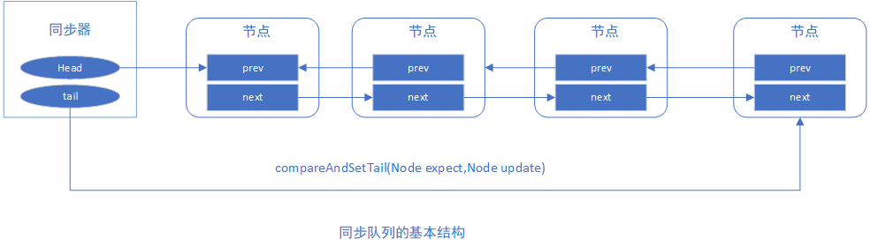
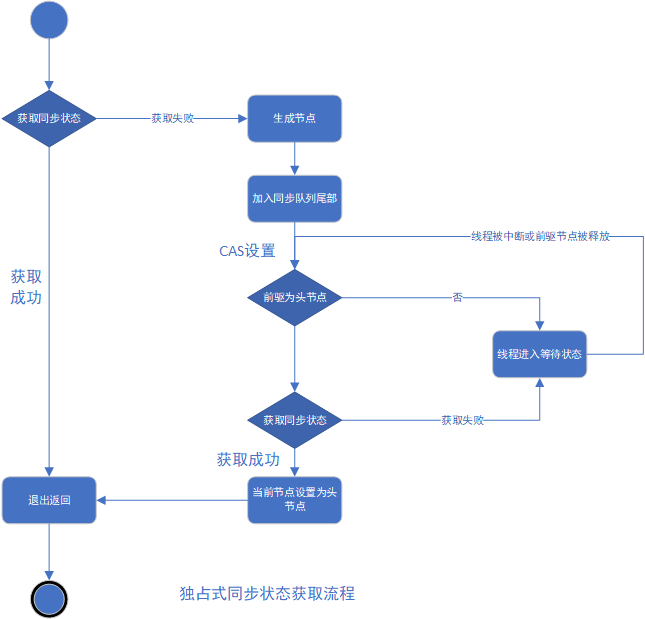

# Java中的锁


## 1. Lock 接口
锁是用来控制多个线程访问共享资源的方式，一般来说，一个锁能够防止多个线程同时访问共享资源（但是有些锁可以允许多个线程同时访问共享资源，比如读写锁）。在Lock接口出现之前，Java程序主要依靠synchronized关键字实现锁功能，Java SE 5之后，并发包中新增了Lock接口（以及其相关实现类）来实现锁功能，它提供了与synchronized关键字类似的同步功能，只是在使用时需要显示地获取和释放锁。
### 1.1 Lock的简单使用
```
Lock lock=new ReentrantLock()；
	//不能将获取锁的过程写到try块中，因为如果在获得锁时发生异常，异常抛出的同时也会导致锁无故释放
  lock.lock();
   try{
   	//这里是业务逻辑
    }finally{
    	//这里保证获得锁之后，最终能得到释放
    lock.unlock();
    }
```

## 1.2 Lock接口的特性和常见方法
- **Lock接口拥有的synchronized不具备的主要特性**

|特性|	描述|
| --- | --- |
|尝试非阻塞地获取锁|	当前线程尝试获取锁，如果这一时刻锁没有被其他线程获取到，则成功获取并持有锁|
|能被中断地获取锁|	获取到锁的线程能够响应中断，当获取到锁的线程被中断时，中断异常将会被抛出，同时锁会被释放|
|超时获取锁|	在指定的截止时间之前获取锁， 超过截止时间后仍旧无法获取则返回|

- **Lock的基本方法**

|方法名称|	描述|
| --- | --- |
|void lock()|	获得锁。如果锁不可用，则当前线程将被禁用以进行线程调度，并处于休眠状态，直到获取锁。|
|void lockInterruptibly()|	获取锁，如果可用并立即返回。如果锁不可用，那么当前线程将被禁用以进行线程调度，并且处于休眠状态，和lock()方法不同的是在锁的获取中可以中断当前线程（相应中断）。|
|Condition newCondition()|	获取等待通知组件，该组件和当前的锁绑定，当前线程只有获得了锁，才能调用该组件的wait()方法，而调用后，当前线程将释放锁。|
|boolean tryLock()|	只有在调用时才可以获得锁。如果可用，则获取锁定，并立即返回值为true；如果锁不可用，则此方法将立即返回值为false 。|
|boolean tryLock(long time, TimeUnit unit)|	超时获取锁，当前线程在一下三种情况下会返回： 1. 当前线程在超时时间内获得了锁；2.当前线程在超时时间内被中断；3.超时时间结束，返回false.|
|void unlock()|	释放锁。|

## 1.3 队列同步器（AQS）
队列同步器（AbstractQueueSynchronizer），用来构建锁或者其他同步器的的基础框架，它使用了一个int成员变量表示同步状态，通过内置的FIFO队列来完成资源获取线程的派对工作。

同步器的主要使用方式是继承，子类通过继承同步器并实现它的抽象方法来管理同步状态。

同步器提供了3个方法：getState()、setState(int newState)和compareAndSetState(int except,int update)来操作，因为它们能够保证状态的改变是安全的。

子类推荐为自定义同步组件的静态内部类，同步器自身没有实现任何同步接口，它仅仅是定义了若干同步状态获取和释放的方式来供自定义同步组件使用.

同步器既可以支持独占式地获取同步状态，也可以支持共享式地获取同步状态，这样就可方便地实现不同类的同步组件（ReentrantLock、ReentrantReadWriteLock和CountdownLatch)。

```java
//ReentrantLock实现、
/**
     * Creates an instance of {@code ReentrantLock}.
     * This is equivalent to using {@code ReentrantLock(false)}.
     */
    public ReentrantLock() {
        sync = new NonfairSync();
    }

    /**
     * Sync object for non-fair locks
     */
    static final class NonfairSync extends Sync {
        private static final long serialVersionUID = 7316153563782823691L;

        /**
         * Performs lock.  Try immediate barge, backing up to normal
         * acquire on failure.
         */
        final void lock() {
            if (compareAndSetState(0, 1))
                setExclusiveOwnerThread(Thread.currentThread());
            else
                acquire(1);
        }

        protected final boolean tryAcquire(int acquires) {
            return nonfairTryAcquire(acquires);
        }
    }

	abstract static class Sync extends AbstractQueuedSynchronizer {...}

```


```
private volatile int state;//共享变量，使用volatile修饰保证线程可见性
```

[基于AQS实现独占锁的示例](https://github.com/kuchensheng/mermaid-framework-parent/blob/develop/modules/mermaid-common/src/main/java/com/mermaid/framework/thread/MermaidLock.java)


AQS是一个用来构建锁和同步器的框架，使用AQS能简单且高效地构造出应用广泛的大量的同步器，比如我们提到的ReentrantLock，Semaphore，其他的诸如ReentrantReadWriteLock，SynchronousQueue，FutureTask等等皆是基于AQS的。

### 1.3.1 AQS原理
AQS的核心思想是，如果被请求的共享资源空闲，则将当前请求资源的线程置为有效的工作线程，并且将共享资源设置为锁定状态。如果被请求的共享资源被占用，那么就用CLH队列锁来将暂时获取不到锁的线程加入到队列中。

AQS的设计时基于模板方法模式的，使用者需要继承同步器并重写指定的方法，随后将同步器组合在自定义同步组件的实现中。重写同步器指定的方法时，需要使用同步器提供的3个方法来访问或者修改同步状态

	*	+ getState():获取当前同步状态
	*	+ setState(int newState):设置当前同步状态
	*	+ compareAndSetState(int expect,int update):使用CAS设置当前状态，该方法能保证状态设置的原子性
```
//返回同步状态的当前值
protected final int getState() {  
        return state;
}
 // 设置同步状态的值
protected final void setState(int newState) { 
        state = newState;
}
//原子地（CAS操作）将同步状态值设置为给定值update如果当前同步状态的值等于expect（期望值）
protected final boolean compareAndSetState(int expect, int update) {
        return unsafe.compareAndSwapInt(this, stateOffset, expect, update);
}
```

- AQS的接口和示例

|方法名称|描述|
| --- | --- |
|boolean tryAqured(int arg)|独占式获取同步状态|
|boolean tryRelease(int arg)|独占式释放同步状态|
|int tryAcquiredShared(int arg)|共享式获取同步状态|
|boolean tryReleaseShared(int arg)|共享式释放同步状态|
|boolan isHeldExclusively()|当前同步器是否在独占模式下被线程占用|

### 1.3.2 队列同步器的实现分析
从实现角度分析同步器是如何完成线程同步的，主要包括：同步队列、独占式同步状态获取和释放、共享式同步状态获取与释放以及超时获取同步状态等同步器的核心数据结构与模板方法

#### 1.3.2.1 同步队列
同步器依赖内部的同步队列（一个FIFO双向队列）来完成同步状态的管理，当前线程获取同步状态失败时，同步器会将当前线程以及等待状态信息构造成一个节点(Node)并将其加入同步队列，同时会阻塞当前线程，当同步状态释放时，会把首节点中的线程唤醒，使其再次尝试获取同步状态。

同步队列中的节点(Node)用来保存获取同步状态失败的线程引用、等待状态以及前驱和后继节点，节点的属性类型和名称以及描述如下：

|属性类型与名称|描述
| ----- | -----|
|int waitStatus|等待状态。包含如下状态。① CANCLELED，值为1，由于在同步队列中等待的线程等待超时或者被中断，需要从同步队列中取消等待，节点进入该状态将不会变化。② SIGNAL,值为-1，后继节点的线程处于等待状态，而当前节点的线程如果释放了同步状态或者被取消，将会通知后继节点，使后继节点的线程得以运行。③ CONDITION，值为-2，节点在等待队列中，节点线程等待在Condition上，当其他线程对Condition调用了signal()方法后，该节点将会从等待队列转移到同步队列中，加入到对同步状态的获取中。④ PROPAGATE，值为-3，表示下一次共享式同步状态将会无条件地被传播下去⑤ INITIAL，值为0，初识状态|
|Node prev|前驱节点，当节点加入同步队列时被设置（尾部添加）|
|Node next|后继节点|
|Node nextWaiter|等待队列中的后继节点。如果当前节点是共享的，那么这个字段是一个SHARED常量，也就是说节点类型和等待队列中的后继节点共用同一个字段|
|Thread thread|获取同步状态的线程|

节点是构成同步队列的基础，同步器拥有首节点head和尾节点tail，没有成功获取同步状态的线程将会成为节点加入该队列的尾部。



同步队列遵循FIFO，首节点是获取同步状态成功的节点，首节点的线程在释放同步状态时，会唤醒后继节点，而后继节点将会在获取同步状态成功时将自己设置为首节点。

#### 1.3.2.2 独占式同步状态获取与释放
通过调用同步器的aquire(int arg)方法可以获取同步状态，该方法对中断不敏感，也就是由于线程获取同步状态失败后进入同步队列，后续对线程进行中断操作，线程不会从同步队列中移除。
```java
/**
 * 这段代码完成了同步状态获取、节点构造、加入同步队列以及在同步队列中自旋等待的相关工作。
 * 其主要逻辑：
 * 首先调用自定义同步器实现的tryAquire(int arg)方法，保证线程安全地获取同步状态，
 * 如果同步状态获取失败，则构造同步节点（独占式Node.EXCLUSIVE,同一时刻只能有一个线程成功获取同步状态)
 * 并通过addWaiter(Node node)方法将该节点加入到同步队列的尾部
 * 最后调用aquireQueued（Node node，int arg）方法，是的该节点以“无限循环”的方式获取同步状态。
 * 如果获取不到则阻塞节点中的线程，而被阻塞线程的唤醒主要依靠前驱节点的出队或阻塞线程被中断来实现
 */
public final void acquire(int arg) {
        if (!tryAcquire(arg) &&
            acquireQueued(addWaiter(Node.EXCLUSIVE), arg))
            selfInterrupt();
    }

private Node addWaiter(Node mode) {
        Node node = new Node(Thread.currentThread(), mode);
        // Try the fast path of enq; backup to full enq on failure
        Node pred = tail;
        if (pred != null) {
            node.prev = pred;
            //确保节点能够被线程安全添加
            if (compareAndSetTail(pred, node)) {
                pred.next = node;
                return node;
            }
        }
        enq(node);
        return node;
    }

private Node enq(final Node node) {
	//通过死循环来保证节点的正确添加，在for循环中，只有通过CAS将节点设置为尾节点后，
	//当前线程才能从该方法返回，否则，当前线程会不断地尝试重试。
        for (;;) {
            Node t = tail;
            if (t == null) { // Must initialize
                if (compareAndSetHead(new Node()))
                    tail = head;
            } else {
                node.prev = t;
                if (compareAndSetTail(t, node)) {
                    t.next = node;
                    return t;
                }
            }
        }
    }

//节点进入同步器后，就进入了一个自旋的过程，每个节点或者说线程都在自省地观察，
//当条件满足，获得到同步状态，就可以从这个自旋过程中退出，否则依旧留在这个自旋过程中。
final boolean acquireQueued(final Node node, int arg) {
        boolean failed = true;
        try {
            boolean interrupted = false;
            for (;;) {
                final Node p = node.predecessor();
                /**
                 * 这段代码保证了只有前驱节点是头节点才能够尝试获取同步状态。
                 * 这是因为：第一、头结点是成功获取到同步状态的节点，而头结点的线程释放了同步状态之后，将会唤醒其后继节点，后继节点被唤醒后需要检查自己的前驱节点是否是头节点。
                 * 第二：维护同步队列的FIFO原色。
                 */
                if (p == head && tryAcquire(arg)) {
                    setHead(node);
                    p.next = null; // help GC
                    failed = false;
                    return interrupted;
                }
                if (shouldParkAfterFailedAcquire(p, node) &&
                    parkAndCheckInterrupt())
                    interrupted = true;
            }
        } finally {
            if (failed)
                cancelAcquire(node);
        }
    }

/**
 * 该方法执行时，会唤醒头节点的后继节点线程，unparkSuccessor(Node node)方法使用LockSupport来唤醒处于等待状态的线程
 */
public final boolean release(int arg) {
        if (tryRelease(arg)) {
            Node h = head;
            if (h != null && h.waitStatus != 0)
                unparkSuccessor(h);
            return true;
        }
        return false;
    }
```
独占式同步状态获取流程，也就是acquire(int arg)方法调用流程如下：



#### 1.3.2.3 总结
在获取同步状态时，同步器维护一个同步队列，获取状态失败的线程都会被加入到队列中并在队列中进行自旋；移出队列或停止自旋的条件是前驱节点为头节点并且成功获取了同步状态。在释放同步状态时，同步器调用tryRelease(int arg)方法释放同步状态，然后唤醒头节点的后继节点。

### 1.3.2.4 共享式同步状态获取与释放
共享式获取与独占式获取最主要的区别在于同一时刻能否有多个线程同时获取到同步状态。
```java
public final void acquireShared(int arg) {
	//tryAcquiredShared(int arg)方法尝试获取同步状态，当值>=0,表示能够获取到同步状态。
        if (tryAcquireShared(arg) < 0)
            doAcquireShared(arg);
    }

private void doAcquireShared(int arg) {
        final Node node = addWaiter(Node.SHARED);
        boolean failed = true;
        try {
            boolean interrupted = false;
            for (;;) {
                final Node p = node.predecessor();
                if (p == head) {
                	//r>=0结束自旋
                    int r = tryAcquireShared(arg);
                    if (r >= 0) {
                        setHeadAndPropagate(node, r);
                        p.next = null; // help GC
                        if (interrupted)
                            selfInterrupt();
                        failed = false;
                        return;
                    }
                }
                if (shouldParkAfterFailedAcquire(p, node) &&
                    parkAndCheckInterrupt())
                    interrupted = true;
            }
        } finally {
            if (failed)
                cancelAcquire(node);
        }
    }
public final boolean releaseShared(int arg) {
        if (tryReleaseShared(arg)) {
            doReleaseShared();
            return true;
        }
        return false;
    }
```

## 重入锁ReentrantLock
重入锁表示该锁能够支持一个线程对资源的重复加锁。除此之外，该锁还支持获取锁时的公平和非公平性选择
ReentrantLock虽然没能像synchronized关键字那样支持隐式的重进入，但是在调用lock()方法时，已经获取到锁的线程，能够再次调用lcok()方法获取锁而不是阻塞。
锁的公平性：如果在绝对公平的时间上，先对锁进行获取的请求一定先被满足，那么这个锁就是公平的，否则是不公平的。
### ReentrantLock类常见的方法
+ 构造器

|方法名称|	描述|
| --- | --- |
|ReentrantLock()|	创建一个 ReentrantLock的实例。|
|ReentrantLock(boolean fair)|	创建一个特定锁类型（公平锁/非公平锁）的ReentrantLock的实例|

## ReentrantReadWriteLock 读写锁
ReentrantLock（排他锁）具有完全互斥排他的效果，即同一时刻只允许一个线程访问，这样做虽然虽然保证了实例变量的线程安全性，但效率低下。ReadWriteLock接口的实现类-ReentrantReadWriteLock读写锁就是为了解决这个问题。
读写锁维护了两个锁，一个是读操作相关的锁为共享锁，一个是写操作相关的锁为排他锁。通过分离读锁和写锁，其并发性比一般排他锁有了很大提升。

### ReentrantReadWriteLock的特性与常见方法
ReentrantReadWriteLock的特性：

|特性|	说明|
| --- | --- |
|公平性选择|	支持非公平（默认）和公平的锁获取方式，吞吐量上来看还是非公平优于公平|
|重进入|	该锁支持重进入，以读写线程为例：读线程在获取了读锁之后，能够再次获取读锁。而写线程在获取了写锁之后能够再次获取写锁也能够同时获取读锁|
|锁降级|	遵循获取写锁、获取读锁再释放写锁的次序，写锁能够降级称为读锁|

### 读写锁的接口与示例
ReadWriteLock仅定义了获取读锁和写锁两个办法，readLock()和writeLock()。
- 读读共享
两个线程同时运行read方法，你会发现两个线程可以同时或者说是几乎同时运行lock()方法后面的代码，输出的两句话显示的时间一样。这样提高了程序的运行效率。
```
private ReentrantReadWriteLock lock = new ReentrantReadWriteLock();

    public void read() {
        try {
            try {
                lock.readLock().lock();
                System.out.println("获得读锁" + Thread.currentThread().getName()
                        + " " + System.currentTimeMillis());
                Thread.sleep(10000);
            } finally {
                lock.readLock().unlock();
            }
        } catch (InterruptedException e) {
            // TODO Auto-generated catch block
            e.printStackTrace();
        }
    }
```

- 写写互斥
两个线程同时运行write方法，你会发现同一时间只允许一个线程执行lock()方法后面的代码
```
private ReentrantReadWriteLock lock = new ReentrantReadWriteLock();

    public void write() {
        try {
            try {
                lock.writeLock().lock();
                System.out.println("获得写锁" + Thread.currentThread().getName()
                        + " " + System.currentTimeMillis());
                Thread.sleep(10000);
            } finally {
                lock.writeLock().unlock();
            }
        } catch (InterruptedException e) {
            // TODO Auto-generated catch block
            e.printStackTrace();
        }
    }
```
