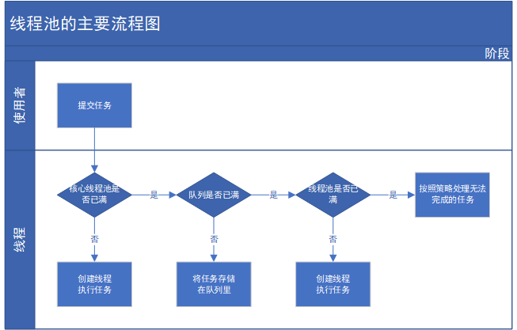

# Java多线程学习
## 进程和线程
+ 进程是程序的一次执行过程，是系统运行程序的基本单位，因此进程是动态的。
+ 线程与进程类似，但线程是一个比进程更小的执行单位，同类的多个线程共享同一块内存空间和一组系统资源，所以系统在产生一个线程或者在各个线程之间切换工作时，负担比进程小很多。

## 何为多线程
多线程就是多个线程同时运行或者交替运行。单核CPU的话是顺序执行，也就是交替执行。多核CPU的话，因为每个CPU有自己的运算器，所以在多个CPU中可以同时运行。

## 多线程的几个概念
+ 同步和异步
	*	同步和异步通常用来形容一次方法调用。
	*	同步方法一旦开始调用，调用者必须等到方法调用返回后，才能继续后续的操作。
	*	异步方法调用更像一个消息传递，一旦开始，方法调用立即返回，调用者可以继续后续的操作
+ 并发（Concurrency）和并行（Parallelism）
	*	并发偏重多个任务交替执行，而多个任务之间有可能是串行的。
	*	并行是真正意义上的“同时执行”
	*	多线程在单核CPU中式交替执行。在多核CPU中可以同时执行
+ 高并发
	* 高并发是互联网分布式系统架构设计中必须考虑的因素之一。通常指通过设计保证系统能够同时并行处理很多请求。
	* 高并发常用的一些指标有**响应时间，吞吐量，每秒查询率QPS，并发用户**等
+ 临界区
临界区用来表示一种公共资源或者说共享数据，可以被多个线程使用。但每一次，只能有一个线程使用它，一单临界区资源被占用，其他线程想要使用这个资源，就必须等待。
+ 阻塞和非阻塞
	- 非阻塞指在不能立即得到结果前，该函数不会阻塞当前线程，而是会立即返回，
	- 阻塞与非阻塞刚好相反

## 使用多线程的三种方式
1. 继承Thread
2. 实现Runnable。推荐实现Runnable接口开发多线程，因为Java单继承但是可以多实现
3.使用线程池

## 常用方法说明
+ currentThread():返回当前正在执行的线程对象的引用
+ getId():返回此线程的标识符
+ getName():返回此线程名称
+ getPriority():返回此线程的优先级
+ isAlive():检测这个线程是否处于活动状态
+ sleep(long millis):使当前正在执行的线程以指定好描述休眠
+ interrupt():中断线程
+ join():等待该线程终止
+ yield():放弃当前的CPU资源，将它让给其他的任务去占用CPU时间。放弃时间不确定

## synchronized关键字
Java并发编程这个领域中synchronized关键字一直都是元老级的角色，很久之前很多人都会称它为“重量级锁”。但是，在JavaSE 1.6之后进行了主要包括**为了减少获得锁和释放锁带来的性能消耗而引入的偏向锁和轻量级锁以及其它各种优化**之后变得在某些情况下并不是那么重了。
### 变量安全性
如果两个线程同时操作对象中的实例变量，则会出现“非线程安全”，解决办法就是在方法前加上synchronized关键字即可。
### 多个对象多个锁
由于synchronized用的是存在对象头里的。而不是把一段代码或方法当做锁。所以在线程执行中，无论哪个线程先执行带synchronized修饰的方法，则哪个线程就持有该方法属于对象的锁，那么其他线程只能处于等待状态。
### 锁的升级与对比
在Java SE1.6为了减少获得锁和释放锁带来的性能消耗，引入了“偏向锁”和“轻量级锁”，在Java SE 1.6之后，锁一共有4中状态，级别从低到高依次是：无锁状态、偏向锁状态、轻量级锁状态和重量级锁状态。锁随着竞争情况逐渐升级，**只能升级，不能降级**
+ 偏向锁
	* 当一个线程访问同步块并获取锁时，会在对象头和栈帧的锁记录里存储锁偏向的线程ID，以后该线程再进入和退出同步块时不需要进行CAS操作来加锁和解锁，只需要简单测试一下对象头的Mark Word里是否存储着偏向锁，成功则表示已获得了锁。
+ 轻量级锁
	* 线程再执行同步块之前，JVM会先在当前线程的栈帧中创建用于存储锁记录的空间，并将对象头中的Mark Word复制到锁记录中，然后尝试使用CAS将对象头中的Mark Word替换为指向锁记录的指针。如果成功，当前线程获得锁。解锁是加锁的逆过程。如果解锁失败，表示当前锁存在竞争，锁就会膨胀成重量级锁。
## synchronized的应用
+ 对于普通同步方法，锁是当前实例的对象
+ 对于静态同步方法，锁时当前类的Class对象
+ 对于同步方法块，锁时synchronized括号里配置的对象

## volatile关键字
volatile定义：Java编程语言允许线程访问共享变量，为了确保共享变量能被准确和一致地更新，线程应该确保通过排他锁单独获得这个变量。如果一个字段被声明成volatile，Java线程内存模型确保所有线程看到这个变量的值是一致的。
### volatile是如何保证可见性的？
有volatile变量修饰符的共享变量进行写操作时会在汇编指令中多出Lock前缀指令。这个指令**将当前处理器缓存行的数据写会到系统内存，这个写会内存的操作会让其他CPU里缓存了该内存地址的数据无效**。如果对声明了volatile的变量进行写操作，JVM就会向处理器发送一条LOCK前缀的指令，将这个变量所在缓存的数据写会到系统内存。每个处理器通过嗅探在总线传播的数据来检查自己缓存的值是否是过期了，如果过期了，就会将当前处理器的缓存行设置为无效状态
### volatile不能替代synchronized
volatile不能保证对变量的原子性。它仅仅保证了共享变量对各个线程可见性。而不能解决多个线程之间访问的同步性
※ 锁的happens-before规则保证释放锁和获得锁的两个线程之间的内存可见性，这意味着对一个volatile变量的读，总是能看到对这个volatile变量最后的写入
※ * volatile写的内存语义
	```
	当写一个volatile变量时，JMM会把该线程对应的本地内存中的共享变量值刷新到主内存
	```
※ * volatile读的内存语义
	```
	当读一个volatile变量时，JMM会把该线程对应的本地内存置为无效，线程接下来直接从主内存中读取共享变量
	```

## 等待/通知机制
等待/通知机制，是指一个线程A调用了对象Object的wait()方法进入等待状态，而另一个线程B调用了对象Object的notify()或者notifyAll()方法，线程A收到通知后从对象Object的wait()方法返回，进而执行后续操作。上述两个线程通过对象Object来完成交互，而对象Object的wait()和notify()/notifyAll()的关系就如同开关信号一样，用来完成等待方和通知方的交互工作。

### 等待/通知机制的相关方法

|方法名称|	描述|

|notify()	|随机唤醒等待队列中等待同一共享资源的 |“一个线程”，并使该线程退出等待队列，进入可运行状态，也就是notify()方法仅通知“一个线程”|
|notifyAll()	|使所有正在等待队列中等待同一共享资源的 “全部线程” 退出等待队列，进入可运行状态。此时，优先级最高的那个线程最先执行，但也有可能是随机执行，这取决于JVM虚拟机的实现|
|wait()	|使调用该方法的线程释放共享资源锁，然后从运行状态退出，进入等待队列，直到被再次唤醒|
|wait(long)	|超时等待一段时间，这里的参数时间是毫秒，也就是等待长达n毫秒，如果没有通知就超时返回|
|wait(long，int)	|对于超时时间更细力度的控制，可以达到纳秒|

**除此之外，也可以利用Condition接口的await/signal来实现等待/通知机制**
### ThreadLocal的使用
ThreadLocal，即线程变量，是一个以ThreadLocal对象为键、任意对象为值的存储结构。这个结构被附带在线程上，也就说一个线程可以根据一个ThreadLocal对象查询到绑定在这个线程上的一个值

### 线程的基本状态


### 线程池与Executor框架
Java中的线程池时运用场景最多的并发框架，几乎所有需要异步或并发任务的程序都可以使用线程池。在开发过程中，合理地利用线程池可以带来三个好处：
+ **降低资源消耗**。通过重复利用已创建的线程减低线程创建和销毁造成的损耗
+ **提高响应速度**。当任务到达时，任务可以不需要等待线程创建就可以立即执行
+ **提高线程的可管理型**。线程是稀缺资源，如果无限制地创建，不仅会消耗系统资源，还会降低系统的稳定性。使用线程池可以进行统一的分配，调优和监控。

#### 线程池的实现原理
当向线程池提交一个任务后，线程池是如何处理这个任务的呢？处理流程图如下



从图中可以看出，当提交一个新任务到线程池时，线程池的处理如下：
1) 线程池判断核心线程池里的线程是否都在执行任务。如果不是，则创建一个新的工作线程来执行任务。如果核心线程池里的线程都在执行任务，则进入第二步
2) 线程池判断工作队列是否已满。如果工作队列没有满，则将新提交的任务存储在这个工作队列里。如果工作队列满了，则进入第三步
3) 线程池判断线程池里的线程是否都处于工作状态。如果没有，则创建一个新的工作线程来执行任务。如果已经满了，则交给饱和处理策略来处理这个任务

**ThreadPoolExecutor**
Executors是java线程池的工厂类，通过它可以快速初始化一个符合业务需求的线程池，如Executors.newFixedThreadPool方法可以生成一个拥有固定线程数的线程池。

```
public static ExecutorService newFixedThreadPool(int nThreads) {
        return new ThreadPoolExecutor(nThreads, nThreads,
                                      0L, TimeUnit.MILLISECONDS,
                                      new LinkedBlockingQueue<Runnable>());
    }
```

其本质也是通过不同的参数初始化一个ThreadPoolExecutor对象，具体参数描述如下：

**corePoolSize**

线程池中的核心线程数，当提交一个任务时，线程池创建一个新线程执行任务，直到当前线程数等于corePoolSize；如果当前线程数为corePoolSize，继续提交的任务被保存到阻塞队列中，等待被执行；如果执行了线程池的prestartAllCoreThreads()方法，线程池会提前创建并启动所有核心线程。

**maximumPoolSize**

线程池中允许的最大线程数。如果当前阻塞队列满了，且继续提交任务，则创建新的线程执行任务，前提是当前线程数小于maximumPoolSize

**keepAliveTime**

线程空闲时的存活时间，即当线程没有任务执行时，继续存活的时间；默认情况下，该参数只在线程数大于corePoolSize时才有用

**unit**

keepAliveTime的单位；

**workQueue**

用来保存等待被执行的任务的阻塞队列，且任务必须实现Runable接口，在JDK中提供了如下阻塞队列：
1、ArrayBlockingQueue：基于数组结构的有界阻塞队列，按FIFO排序任务；
2、LinkedBlockingQuene：基于链表结构的阻塞队列，按FIFO排序任务，吞吐量通常要高于ArrayBlockingQuene；
3、SynchronousQuene：一个不存储元素的阻塞队列，每个插入操作必须等到另一个线程调用移除操作，否则插入操作一直处于阻塞状态，吞吐量通常要高于LinkedBlockingQuene；
4、priorityBlockingQuene：具有优先级的无界阻塞队列；

#### 线程池的使用
见[Java多线程学习（八）线程池与Executor 框架](https://blog.csdn.net/qq_34337272/article/details/79959271)

## Java内存模型
### Java内存模型基础
在Java中，所有**实例域、静态域、数组元素**都存储在**堆（Heap）**中，堆内存在线程之间共享。局部变量、方法定义参数存储在**虚拟机栈**中，不会再线程之间共享，所以它们不会有内存可见性问题，也不受内存模型的影响

 Java线程之间的通信由Java内存模型(JMM)控制，JMM决定一个线程对共享变量的写入何时对另一个线程可见。Java内存模型的抽象示意图如下：

 

### 重排序
重排序是指编译器和处理器为了优化程序性能二队指令顺序进行重新排序的一种手段。
重排序分为3种：
* 编译器优化的重排序。编译器在不改变单线程语义的前提下，可以重新安排语句的执行顺序
* 指令级并行的重排序。现代处理器采用了指令级并行技术来将多条指令重叠执行。如果不存在数据依赖性，处理器可以改变语句对应机器指令的执行顺序
* 内存系统的重排序。由于处理器使用缓存和读/写缓冲区，这使得加载和存储操作看上去可能是乱序执行。

**重排序对多线程的影响**：在单线程程序中，对存在控制依赖的操作重排序，不会改变执行结果。但是在多线程程序中，对存在控制依赖的操作重排序，可能会改变程序的运行结果。

#### as-if-serial语义
不管怎么重排序，程序的执行结果不能改变。
