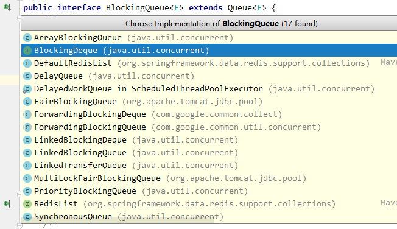

# Java并发容器和框架
JDK提供的这些容器大部分都在java.util.concurrent包中。主要包括
+ ConcurrentHashMap：线程安全地HashMap
+ CopyOnWriteArrayList：线程安全的List，在读多写少的场合性能比Vector好
+ ConcurrentLinkedQueue：高效的并发队列，使用链表实现
+ BlockingQueue：阻塞队列，非常适合用于作为数据共享的通道
+ ConcurrentSkipListMap：跳表，使用跳表的数据结构进行快速查找

## ConcurrentHashMap的实现原理与应用

### 为什么要使用ConcurrentHashMap
在并发过程中使用HashMap可能会造成程序死循环。使用线程安全的HashTable效率又非常低下。所以就又了ConcurrentHashMap。
+ 线程不安全的HashMap
	*	在多线程环境下，使用HashMap进行put操作会引起死循环，导致CPU使用率近乎100%。这是因为多线程会导致HashMap的Entry链表形成环形数据结构，一旦形成环形数据结构，Entry的next节点用于不为空，就会产生死循环获取entry
+ 效率低下的HashTable
	*	HashTable容器在竞争激烈的并发环境下表现出效率低下的原因是所有访问HashTable的线程都必须竞争同一把锁。假如容器里有多把锁，每一把锁用于锁容器其中一部分数据，name当多线程访问容器里不同数据段的数据时，线程间就不会存在竞争，从而可以有效提高并发访问效率，这就是ConcurrentHashMap所使用的锁分段技术。（JDK 1.8之后不再使用锁分段，而是直接用synchronized和CAS算法来操作，虽然在JDK1.8还能看到Segment数据结构，但这只是为了兼容旧版本。）
详细内容可见[ConcurrentHashMap和HashTable的区别](https://github.com/kuchensheng/java-knowledge-mapping/blob/master/Java%E9%9B%86%E5%90%88%E6%A1%86%E6%9E%B6.md#concurrenthashmap%E5%92%8Chashtable%E7%9A%84%E5%8C%BA%E5%88%AB)

## CopyOnWriteArrayList
### CopyOnWriteArrayList简介
在很多应用场景中，读操作可能会远远大于写操作。由于读操作根本不会修改原有的数据，因此对于每次读取都进行加锁其实是一种资源浪费。我们应该允许多个线程同时访问List的内部数据，毕竟读取操作是安全的。

这和我们之前在多线程章节讲过 ReentrantReadWriteLock 读写锁的思想非常类似，也就是读读共享、写写互斥、读写互斥、写读互斥。JDK中提供了 CopyOnWriteArrayList 类比相比于在读写锁的思想又更进一步。为了将读取的性能发挥到极致，CopyOnWriteArrayList 读取是完全不用加锁的，并且更厉害的是：写入也不会阻塞读取操作。只有写入和写入之间需要进行同步等待。这样一来，读操作的性能就会大幅度提升。

### CopyOnWriteArrayList的实现
CopyOnWriteArrayList 类的所有可变操作（add，set等等）都是通过**创建底层数组的新副本**来实现的。当List需要被修改的时候，对原有数据进行一次复制，将修改的内容写入副本。写完之后，再将修改完的副本替换为原来的数据，这样就保证写操作不会影响读操作了。
+ 读操作的实现

读操作没有任何同步控制和操作，理由就是内部数组Array不会发生修改，只会被另一个Array替换，一次数据时安全的
```
	private transient volatile Object[] array;
    public E get(int index) {
        return get(getArray(), index);
    }
    @SuppressWarnings("unchecked")
    private E get(Object[] a, int index) {
        return (E) a[index];
    }
    final Object[] getArray() {
        return array;
    }
```
+ 写操作的实现

add() 方法在添加集合的时候加了锁，保证了同步，避免了多线程写的时候会 copy 出多个副本出来。
```
	/**
     * Appends the specified element to the end of this list.
     *
     * @param e element to be appended to this list
     * @return {@code true} (as specified by {@link Collection#add})
     */
    public boolean add(E e) {
        final ReentrantLock lock = this.lock;
        lock.lock();//加锁
        try {
            Object[] elements = getArray();
            int len = elements.length;
            Object[] newElements = Arrays.copyOf(elements, len + 1);//拷贝新数组
            newElements[len] = e;
            setArray(newElements);
            return true;
        } finally {
            lock.unlock();//释放锁
        }
    }
```
## ConcurrentLinkedQueue

Java提供的线程安全的Queue可以分为阻塞队列和非阻塞队列，其中阻塞队列的典型例子是BlockingQueue，非阻塞队列的典型例子是ConcurrentLinkedQueue，在实际应用中要根据实际需要选用阻塞队列或者非阻塞队列。阻塞队列可以通过加锁来实现，非阻塞队列可以通过CAS操作实现。

ConcurrentLinkedQueue 适合在对性能要求相对较高，同时对队列的读写存在多个线程同时进行的场景，即如果对队列加锁的成本较高则适合使用无锁的ConcurrentLinkedQueue来替代。

## 阻塞队列（BlockingQueue）
阻塞队列是一个支持两个附加操作的队列。这两个附加的操作支持阻塞的插入和移除方法。
- 支持阻塞的插入：当队列满时，队列会阻塞插入元素的线程，直到队列不满
- 支持阻塞的移除：当队列为空时，获取元素的线程会等待队列为非空
基于这两个操作，阻塞队列常用于生产者和消费者的场景。
在队列不可用时，这两个操作提供了4中处理方式
	*	1.抛出异常。队列满（IllegalStateException），队列为空（NoSuchElementException）
	*	2.返回特殊值。队列插入成功，返回true，如果是移除方法，则从队列里去除一个元素，如果没有则返回null
	*	3.一直阻塞。直到操作完成
	*	4.超时退出
### Java中的阻塞队列


### 阻塞队列的实现原理
如果队列为空，消费者会一直等待，当生产者添加元素时，消费者是如何知道当前队列有元素呢？
**使用通知模式实现**。所谓通知模式，就是当生产者往满的队列里添加元素时会阻塞住，该生产者会被阻塞住。当消费者消费了一个队列的元素后，会通知生产者当前队列可用。通过JDK源码发现ArrayBlockingQueue使用了Condition来实现
```
/** Main lock guarding all access */
final ReentrantLock lock;

/** Condition for waiting takes */
private final Condition notEmpty;

/** Condition for waiting puts */
private final Condition notFull;

public ArrayBlockingQueue(int capacity, boolean fair) {
        if (capacity <= 0)
            throw new IllegalArgumentException();
        this.items = new Object[capacity];
        lock = new ReentrantLock(fair);
        notEmpty = lock.newCondition();
        notFull =  lock.newCondition();
    }

	/**
     * Inserts the specified element at the tail of this queue, waiting
     * for space to become available if the queue is full.
     *
     * @throws InterruptedException {@inheritDoc}
     * @throws NullPointerException {@inheritDoc}
     */
    public void put(E e) throws InterruptedException {
        checkNotNull(e);
        final ReentrantLock lock = this.lock;
        lock.lockInterruptibly();
        try {
            while (count == items.length)
                notFull.await();
            enqueue(e);
        } finally {
            lock.unlock();
        }
    }
```
更多详细信息可以阅读《[解读Java并发队列BlockingQueue]https://javadoop.com/post/java-concurrent-queue)》