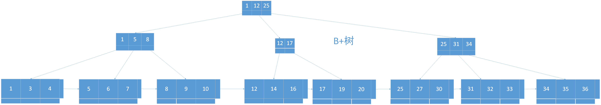

# Mysql优化入门

# 一、高并发如何优化
+ 如果请求太多，判定web服务器的压力过大，增加前端web服务器，做负载均衡
+ 如果请求静态界面不卡，但是动态数据还是卡，说明MySQL处理的请求太多了，在应用层增加缓存
+ 数据库其实是最脆弱的一层，一般在应用设计时在上游就需要把请求拦截掉，数据库层只承担“能力范围内”的访问请求，所以我们通过在服务层引入队列（MQ）和缓存，让最底层的数据库高枕无忧。但是如果请求激增，还是有大量的查询压力到MySQL，这个时候就要想办法解决MySQL的瓶颈了。

**总结：** 系统优化的第一步，是绝对轮不到MySQL优化，我们之所以要做MySQL的集群，一般都是在做好了应用级别的缓存，请求还是太多的情况下考虑的问题。

# 二、MySQL的执行流程

大致可以分为以下七个步骤：

* 1.当我们请求MySQL服务器的时候，MySQL前端会有一个监听，请求到了之后，服务器得到相关的SQL语句，执行之前，还会做权限判断
* 2.权限通过后，SQL就到MySQL内部查询缓存，看看该SQL有没有执行过，如果有，则把缓存返回。MySQL内部的缓存是**默认不开启**。因为查询缓存要求SQL和参数都要一样，所以这个**缓存命中率很低（没啥用）**。
* 3.如果没有开启查询缓存，或者缓存没有命中，那么就到了解析器，解析器主要对SQL语法进行解析
* 4.解析结束后，得到解析树。这个时候还不能执行，要对这棵树进行预处理。预处理完毕后，得到比较规范的树，这棵树就是要马上去执行的树，比起之前的解析树得到了一些优化。
* 5.**优化查询器，是MySQL里面最关键的东西**。我们写一条SQL，比如SELECT * FROM USER WHERE USERNAME=myName AND PASSWORD= '123456';
它会怎么执行？它是先执行USERNAME=myName还是PASSWORD= '123456'?每一条SQL的执行顺序查询优化器就是根据MySQL对数据统计表的一些信息,比如索引,比如表一共有多少数据,MySQL都是有缓存起来的,在真正执行SQL之前,他会根据自己的这些数据,进行一个综合的判定,判断这一次在多种执行方式里面,到底选哪一种执行方式,可能运行的最快.这一步是MySQL性能中,最关键的核心点,也是我们的优化原则.**优化SQL说白了，就是让查询优化器按照我们的想法帮我们选择最优的方案**
* 6.优化查询器生成查询计划，这个查询计划会传递查询执行引擎，执行引擎选择存储引擎来执行这一份过来的计划。这个时候影响查询性能的最根本原因是**硬盘的机械运动，也就是IO**，所以一条查询语句的快慢，就是根据这个IO来确定的。
* 7.如果开了查询缓存，则返回结果给客户端，并且查询缓存也放一份

# 三、索引
## 3.1 什么是索引
索引是存储引擎用来快速查找到记录的一种数据结构。**索引优化**应该是对查询性能优化最有效的手段了。
## 3.2 索引的类型
在MySQL中，索引是在存储引擎层而不是服务器层实现的，所以并没有统一的索引标准。加快查找速度的数据结构，常见的有两类：

 1) 哈希，如HashMap，查询、插入、修改、删除的平均时间复杂度都是O(1)

 2) 树，如二叉树，查询、插入、修改、删除的平均时间复杂度都是O(lg(n))

### 3.2.1 B-Tree索引
如果没有特别指明，一般的索引就是B-Tree索引。

**第一种：二叉搜索树**

这种树不适合做索引，原因如下：
* 1. 当数据量大的时候，树的高度会很高，查询也就比较慢
* 2. 每个节点只存储一个记录，可能导致一次查询有很多磁盘IO

**第二种树：B树**

B树的特点：

1. 不再是二叉搜索，而是**m叉**搜索
2. 叶子节点，非叶子节点都存储数据
3. 中序遍历，可以获得所有节点
4. 能够完美利用局部性原理
5. 由于是m叉搜索，高度较低
6. 每个节点可以存储多个记录，如果将节点大小设置为页大小，例如4K，能够充分利用预读的特性，极大地减少磁盘IO。

**第三种：B+树**

B+树仍然是m叉搜索树，在B树的基础上做了一些改进：

1. 非叶子结点不再存储数据，*数据只存储在同一层的叶子节点上*
2. 根节点到每一个节点的路径长度是一样的
3. 叶子之间，增加了链表，获取所有节点，不再需要中序遍历

这些改进让B+树有以下特点：

1. 范围查找：定位min和max之后，中间叶子节点就是结果集，不用中序回溯。
2. 叶子节点存储实际记录行，记录行相对比较紧密的存储，适合大数据量磁盘存储；非叶子节点存储记录的PK，用于查询加速，适合内存存储。
3. 非叶子节点不存储实际记录，而只存储记录的KEY，那么在相同内存下，B+树能够存储更多的索引。

**什么是局部性原理**

(1)内存读写快，磁盘读写慢，而且慢很多

(2)磁盘预读:磁盘读写是按页读取的，一次会读取一页的数据，以期每次加载更多的数据。如果要读取的数据就在这一页中，可以避免磁盘IO，提高效率。一页大小，默认为4K。

### 3.2.1 哈希索引
hash是一种(key >= value)形式的键值对，允许多个key对应相同的value，但不允许一个key对应多个value。正是由于这个特性，hash很适合做索引，为某一列或几列建立hash索引，就会利用这一列或者几列的值通过一定的算法计算出一个hash值，对应一行或几行数据。hash索引可以一次定位，不需要像树形索引那样逐层查找。

**但是**：
* Hash索引仅能满足“=”、“IN”和“<=>”查询，不能使用范围查询
* Hash索引无法被用来避免数据的排序操作
* Hash索引任何时候都不能避免表扫描
* Hash索引遇到大量Hash值相等的情况后性能并一定比B-Tree索引高。
* SQL语句的需求特性（如group by、order by）等，Hash无法满足
* InnoDB存储引擎并不支持哈希索引

### 3.2.3 空间数据索引(R-TREE)
MyISAM表支持空间索引，可以用作地理数据存储。

### 3.2.3 全文索引
全文索引是一种特殊的索引，它查找的是文本中的关键词，而不是直接比较索引中的值。全文索引更像是搜索引擎做的事情，而不是简单的WHERE条件匹配。

## 3.3 总结
+ 数据库索引用于加速查询
+ 虽然哈希索引的时间复杂度是O(1)，树形索引的时间复杂度是O(lg(n))，但是SQL有很多排序需求，故数据库使用树形索引
+ InnoDB存储引擎不支持哈希索引
+ 数据预读：磁盘读写是按页读取，一次会读取一页的数据，每次加载更多数据，以便减少磁盘IO
+ 局部性原理：软件设计要尽量遵循“数据读取集中”与“使用到一个数据，大概率会使用其附近的数据”，这样磁盘预读能够充分提高磁盘IO效率。
+ 数据库的索引常用B+树

