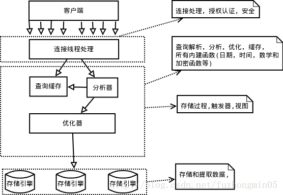

# Mysql入门
## 1.Mysql逻辑架构



MySQL逻辑架构整体分为三层，最上层为客户端层，并非MySQL所独有，诸如：连接处理、授权认证、安全等功能均在这一层处理。

MySQL大多数核心服务均在中间这一层，包括查询解析、分析、优化、缓存、内置函数(比如：时间、数学、加密等函数)。所有的跨存储引擎的功能也在这一层实现：存储过程、触发器、视图等。

最下层为存储引擎，其负责MySQL中的数据存储和提取。和Linux下的文件系统类似，每种存储引擎都有其优势和劣势。中间的服务层通过API与存储引擎通信，这些API接口屏蔽了不同存储引擎间的差异。

每个客户端发起的请求都由服务端的连接/线程处理工具负责接收客户端的请求并开辟一个新的内存空间，在服务器端的内存中生成一个新的线程，当一个用户连接到服务器端的时候就会在进程地址空间生成一个新的线程用于响应客户端请求，用户发起的查询请求都在线程空间内运行，结果也在这里缓存并返回给服务器端。

线程的重用和销毁都是由连接/线程管理器实现的。

## 2.并发控制
无论何时，只要有多个查询需要在同一时刻修改数据，都会产生并发控制的问题。Mysql的并发控制方案：
+ 读写锁。

同一时刻多读少写场景。通过实现读写锁来实现。读锁是共享的，或者说是相互不阻塞的，写锁是排他的。

+ 锁粒度。

提高共享资源并发性的方式是：尽量只锁定需要修改的部分数据，而不是所有的资源。但是加锁也是需要消耗资源的。所以锁策略就是在锁的开销和数据的安全性之间寻求平衡。Mysql提供了多种存储引擎都可以实现自己的所策略和锁粒度。

- 表锁（table lock）

表锁是Mysql中最基本的锁策略，并且是开销最小的策略。它会锁定整张表。然后阻塞其他用户对该表的所有读写操作。服务器为注入ALTER TABLE之类的语句使用表锁而忽略存储引擎的锁机制。

- 行级锁（row lock）

行级锁可以最大程度地支持并发处理（同时也带来最大的锁开销）。InnoDB以及XtraDB就是实现了行级锁。行级锁只在存储引擎层实现，而MySQL服务器没有实现。

- 多版本并发控制

Mysql的大多数事务型存储引擎实现的都不是简单的行级锁。基于提升并发性能的考虑，他们一般都同时实现了多版本并发控制（MVCC）。

可以认为MVCC是行级锁的一个变种，但是它在大多数情况下避免了加锁操作，因此开销更低。

MVCC的实现，是通过保存数据在某个时间点的快照来实现的。也就是说，不管需要执行多长时间，每个事务看到的数据都是一致的。

InnoDB的MVCC是通过在每行记录后面保存两个隐藏的列来实现的。这两个列，一个是保存了行的创建时间，一个保存行的过期时间。存储的并不是实际值，而是系统版本号。每开始一个新的事务，系统版本号就会自动递增。事务开始时刻的系统版本号会作为事务的版本号，用来和查询到的每行记录的版本号进行比较。

## 3 事务
事务就是一组原子性的SQL查询，或者说一个独立的工作单元。具备ACID属性，也即原子性（Atomicity）、一致性（consistency）、隔离性（isolation）和持久性（durability）。
### 3.1 事务隔离级别
简单介绍下四种隔离级别

* 1. READ UNCOMMITED（读未提交）
事务中的修改，即使没有提交，对其他事务也是可见的。此级别会发生脏读。

* 2. READ COMMITED（读提交）
一个事务开始时，只能“看见”已经提交的事务所做的修改。也就是说一个事务从开始直到提交之前，所做的任何修改对其他事务都是不可见的。这个级别也叫不可重复读，因为执行两次同样的查询，可能会得到不一样的结果。

* 3. REPEATABLE READ（可重复读）
可重复读解决了脏读的问题。该级别保证了在同一个事务中多次读取同样记录的结果是一致的。但是可重复读无法解决幻读问题。所谓幻读，指的是当某个事务在读取某个范围内的记录时，另外的一个事务又在该范围内插入了新的记录，当之前的事务再次读取该范围的记录时，会产生幻行。InnoDB和XtraDB存储引擎通过多版本并发控制（MVCC）解决了幻读问题。

* 4. SERIALIZABLE（串行化）
串行化是最高的隔离级别。它通过强制事务串行执行，避免了幻读的情况发生。SERIALIZABLE会在读取的每一行数据上都加锁，所以可能导致大量的超时和锁竞争问题。

### 3.2 死锁
死锁指的是两个或多个事务在同一资源上相互占用，并请求锁定对方占用的资源，从而导致恶性循环的现象。
```text
事务1
	START TRANSACATION；
	UPDATE tx SET close = 45 WHERE id = 2;
	UPDATE tx SET close = 50 WHERE id = 3;
	COMMIT;
事务2
	SSTART TRANSACATION；
	UPDATE tx SET high = 45 WHERE id = 3;
	UPDATE tx SET high = 50 WHERE id = 2;
	COMMIT;
```
如果凑巧，两个事务都执行了第一条UPDATE语句，事务1锁定了id=2的行，事务2锁定了id=3的行，那么再执行第二条UPDATE语句的时候，却发现改行已经被对方锁定，然后两个事务都等待对方释放锁，同时又持有对方需要的锁，则陷入死循环。

InnoDB存储引擎中，当检测到死锁的循环依赖，则立即返回一个错误。并将最少行级排他锁的事务进行回滚。

### 3.3 事务日志
事务日志可以帮助提高事务的效率。使用事务日志，存储引擎在修改表的数据时只需要修改其内存拷贝，再把该修改行记录持久化到硬盘的事务日志中，而不是每次都将修改的数据本身持久化到磁盘。事务日志采用的是追加的方式。

## 4.Mysql存储引擎
### 4.1InnoDB存储引擎。
InnoDB采用MVCC来支持高并发，并实现了四个标准的隔离级别。其默认的级别是REPEATABLE READ（可重复读），并且通过间隙锁（next-key locking）策略防止幻读的出现。间隙锁使得InnoDB不仅仅锁定查询涉及的行，还会对索引中的间隙进行锁定，以防止幻影行的插入。

InnoDB表是基于聚簇索引建立的。聚簇索引对主键查询有很高的性能。不过他的二级索引（非主键索引）中必须包含主键列，所以主键很大的话，其他的所有索引都会很大。因此，若表上的索引比较多的话，主键应当尽可能的小。

InnoDB通过一些机制和工具支持热备份，Oracle 提供的MySQL Enterprise Backup、Percona提供的开源的XtraBackup都可以。MySQL的其他引擎不支持热备份。

### 4.2 MyISAM存储引擎
MyISAM提供了全文索引、压缩、空间函数等特性，但是MyISAM不支持事务和行级锁。而且MyISAM的缺陷是崩溃后无法安全恢复。（MyISAM只将数据写到内存中，然后等待操作系统定期将数据刷到磁盘上）

如果表在创建并导入数据以后，不会再进行修改操作，那么这样的表或许更适合采用MyISAM压缩表。压缩表的数据是不能够进行修改的。压缩表可以极大地减少磁盘空间占用，因此也可以减少IO操作，从而提升查询性能。

### 4.3 转换表的引擎
转换表引擎的方法简单介绍：

**1、ALTER TABLE**

将表从一个存储引擎变更为另一个存储引擎的最简答的方法就是利用ALTER TABLE语句。
```text
mysql>ALTER TABLE table_name ENGINE = InnoDB;
```
这个方法需要执行很长一段时间。MySQL会按行将数据从原表复制到一张新的表中。在复制期间可能会消耗系统所有的IO能力，同时也会在原表上加读锁。

**2、导入与导出**

为了更好地控制转换的过程，可以使用mysqldump工具将数据导出到文件，然后修改文件中CREATE TABLE语句的存储引擎选项。

**3、创建与查询**

不需要导出整个表的数据，而是先创建一个新的存储引擎的表，然后利用INSERT...SELECT语法来导入数据。如果数据量较大，可以采用分批处理的方式，针对每一段数据执行事务提交操作，以避免大事务产生过多的undo。


## 5.数据的存储
在InnoDB存储引擎中，所有的数据都被逻辑地存放在表空间，表空间（tablespace）是存储引擎中最高的存储逻辑单位，表空间的下段又包括段（Segment）、区（Extent）、页（Page）。同一数据库实例的所有表空间都有相同的页大小；默认情况下，表空间的页大小都为16KB，当然也可以通过innodb_page_size参数来修改。
## 5.1 如何存储表
MySQL使用InnoDB存储表时，会将**表的定义和数据索引**分开存储，表的定义存储在**.frm**文件中，数据索引存储在**.idb**文件中。


**.frm文件**：所有的MySQL表都会在硬盘上创建一个.frm文件用来描述表的定义；.frm文件在所有平台上都是相同的。

**.idb文件**：InnoDB中用于存储数据的文件总共有两部分，一是系统表空间文件ibdata1和ibdata2等文件，其中存储了InnoDB系统信息和用户数据表数据和索引，是所有表公用的。当打开innodb_file_per_table选项时，.idb文件就是每一个表独有的空间，文件存储了当前所有表的数据和相关索引信息。
