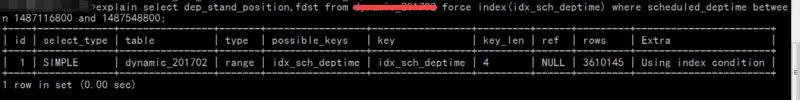
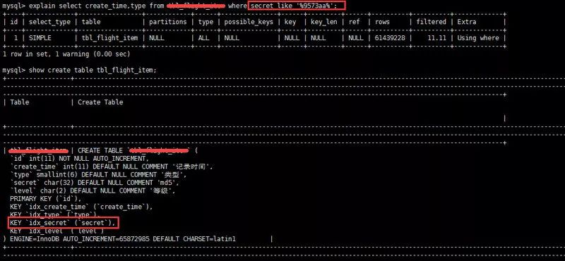
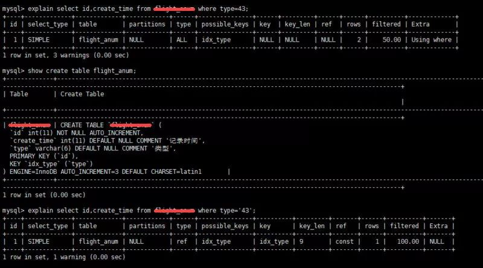

# SQL 优化简介

# 1、explain
利用explain查看SQL执行计划

简单示例：


+ type列：连接类型，一个好的SQL语句至少要达到range级别。杜绝出现all级别
+ key列：使用到的索引名。如果没有索引，值就是NULL。
+ key_len：索引长度
+ rows：扫描行数，是个预估值。扫描行数和结果比应该小于10:1
+ extra类，详细说明

# 2、SQL语句中IN包含的值不应过多
MySQL对于IN做了相应的优化，即将IN中的常量全部存储在一个数组里面，而且这个数组是排好序的。但是如果数值较多，产生的消耗也是比较大的。再例如：
```sql
select id from table_name where num in(1,2,3);
```
对于连续的数值，能用 between 就不要用 in 了；再或者使用连接来替换。

# 3 SELECT语句务必指明字段名称
SELECT *增加很多不必要的消耗（cpu、io、内存、网络带宽）；

增加了使用覆盖索引的可能性；

当表结构发生改变时，前端也需要更新；

增加了无谓的消耗（可能本次查询用不到所有列）；

所以要求直接在select后面接上字段名。

# 4 当只需要一条数据的时候，使用limit 1
这是为了使EXPLAIN中type列达到const类型

# 5 如果排序字段没有用到索引，就尽量少排序

# 6 如果限制条件中，其他字段没有索引，尽量少用or

or两边的字段中，如果有一个不是索引字段，而其他条件也不是索引字段，会造成该查询不走索引的情况。很多时候使用union all 或者union（必要的时候）的方式来代替or

# 7 尽量使用union all 代替union
union和union all的差异主要是union需要将结果集合并后再进行唯一性过滤操作，这就会涉及到排序，增加大量的CPU运算，加大资源消耗及延迟。当然，union all的前提条件是两个结果集没有重复数据。

# 8 不使用ORDER BY RAND()

# 9 区分in和exists，not in和not exists
```sql
select * from ta where id in(select id from tb);

-- 等价于
select * from ta where id exist (select * from tb where using(id));
```
区分in和exists主要是造成了驱动顺序的改变，如果是exists，是以外层表为驱动表，先被访问。而使用in的话，先执行子查询，所以IN适合外表大而内标小的情况；exists适合外表小而内表大的情况。

# 10 分段查询
在一些用户选择的页面，可能一些用户选择的时间范围过大，造成查询缓慢。主要的原因是扫描行数过多。这个时候可以通过程序，分段进行查询，循环遍历，将结果合并处理进行展示。

如下图这个sql语句，扫描的行数成百万级以上的时候就可以使用分段查询



# 11 避免在where子句中对字段进行null值判断
对于NULL的判断会导致引擎放弃使用索引而进行全表扫描

# 12 不建议使用%前缀模糊查询
例如LIKE “%name”或者LIKE “%name%”，这种查询会导致索引失效而进行全表扫描。但是可以使用LIKE “name%”。

如下图所示，虽然给secret字段添加了索引，但在explain结果果并没有使用



那么如何解决这个问题呢，答案：使用全文索引。

在我们查询中经常会用到
```sql
select id,fnum,fdst from table_name where user_name like '%zhangsan%';。
```
这样的语句，普通索引是无法满足查询需求的。庆幸的是在MySQL中，有全文索引来帮助我们。

创建全文索引的sql语法是：
```sql
ALTER TABLE `table_name` ADD FULLTEXT INDEX `idx_user_name` (`user_name`);
```
使用全文索引的SQL语句如下：
```sql
select id,fnum,fdst from table_name 
where match(user_name) against('zhangsan' in boolean mode);
```
# 13 避免在where子句中对字段进行表达式操作
比如：
```sql
select user_id ,user_project from table_name where arg * 2 = 36;
```
对字段就行了算术运算，这会造成引擎放弃使用索引

# 14 避免隐式类型转换
where 子句中出现 column 字段的类型和传入的参数类型不一致的时候发生的类型转换，建议先确定where中的参数类型。



# 15 对于联合索引来说，要遵守最左前缀法则

# 16 必要时可以使用force index来强制查询走某个索引
有的时候MySQL优化器采取它认为合适的索引来检索sql语句，但是可能它所采用的索引并不是我们想要的。这时就可以采用force index来强制优化器使用我们制定的索引。

# 17 关于JOIN优化
- LEFT JOIN 左表为驱动表
- INNER JOIN MySQL会自动找出那个数据少的表作为驱动表
- RIGHT JOIN 右表为驱动表

**建议**：

- 尽量使用inner join，避免left join。
- 合理利用索引。被驱动表的索引字段作为on的限制字段
- 利用小表去驱动大表

# 18 关于SQL拆分
如果有复杂SQL嵌套查询，建议进行SQL拆分。例如：
```sql
SELECT * FROM tag 
    JOIN tag_post ON tag_post.tag_id = tag.tag.id
    JOIN post ON tag_post.post_id = post.id
    WHERE tag.tag='mysql'
```
可以拆解为下面的查询语句来代替：
```sql
mysql>SELECT * FROM tag WHERE tag='mysql';
mysql>SELECT * FROM tag_post WHERE tag_id=1234;
mysql>SELECT * FROM post WHERE post.id in (123,456,789,2023); 
```
到底为什么这么做？乍一看，这样做并没有什么好处，原本一条查询，现在却变成了多条查询，返回结果又一模一样。实际上，用分解关联查询有如下优势：

+ 让缓存命中率更高。许多应用程序可以方便地缓存单表查询对应的结果对象。
+ 将查询分解后，执行单个查询可以减少锁竞争
+ 在应用层关联，可以更容易对数据库进行拆分，更容易做到高性能和可扩展。
+ 查询本身效率也可能会有所提升。使用IN()代替关联查询，可以让MySQL按照ID顺序进行查询，这可能比随机的关联查询效率更高。
+ 可以减少冗余记录的查询。