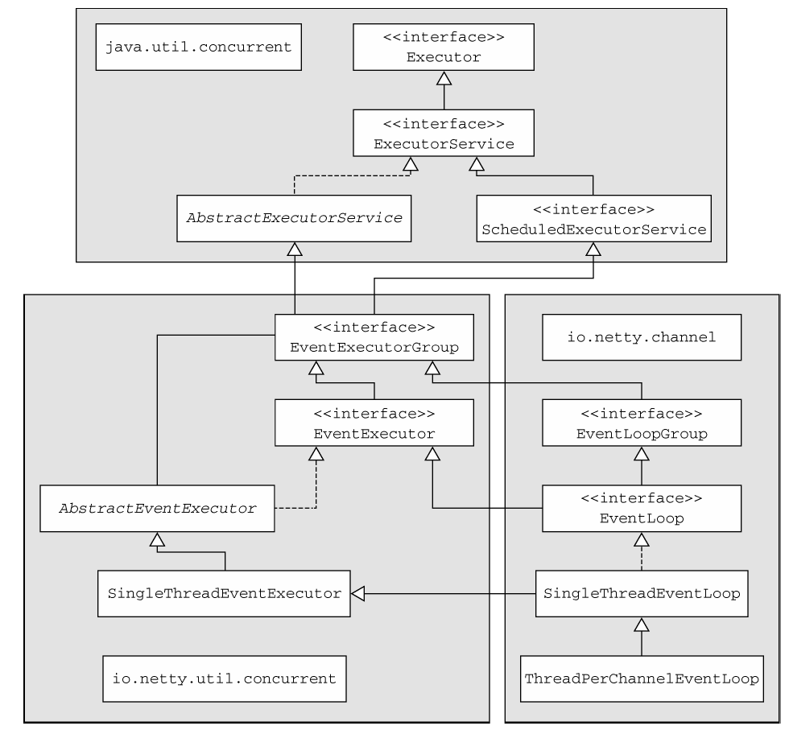
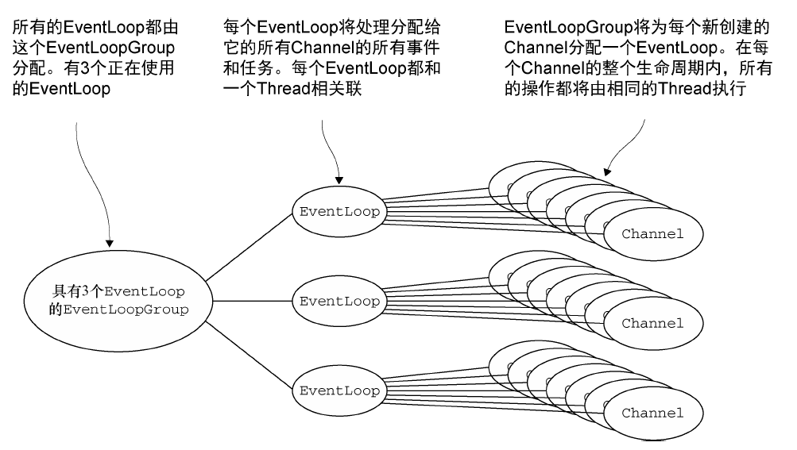
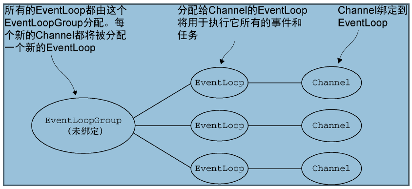
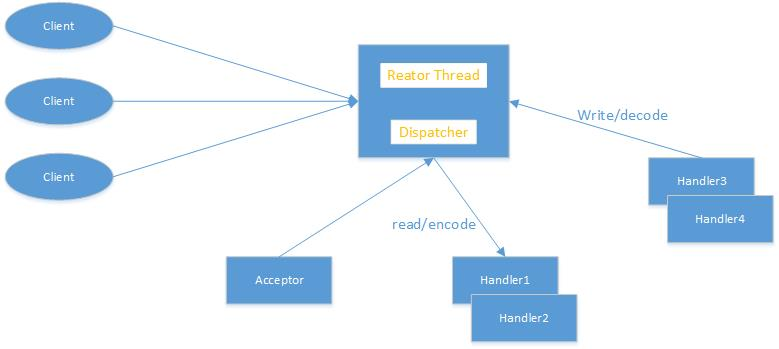
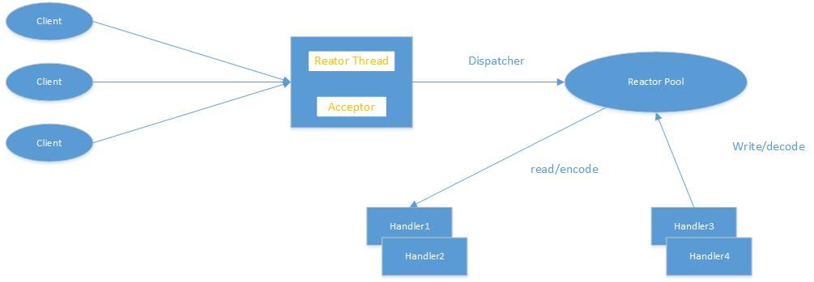

# EventLoop和线程模型
# 线程模型概述
线程模型指定了操作系统、编程语言、框架或者应用程序的上下文中的线程管理的关键信息。
# EventLoop接口
运行任务来处理在连接生命周期内发生的事件是任何网络框架的基本功能。与之相应的编程上的构造通常称为事件循环。Netty使用EventLoop接口来实现

```java
while(!terminated) {
	List<Runnable> readyEvents = blocUnitEventReady();
	for(Runnable ev : readyEvents) {
		ev.run();
	}
}
```

EventLoop的类层次结构



在这个模型中，一个EventLoop将由一个永远都不会改变的Thread驱动，同时任务可以直接提交给EventLoop实现，以实现立即执行或者调度执行。

# 任务调度
JDK采用“juc”包下的ScheduledExecutorService来实现任务调度。但是Netty是用EventLoop实现任务调度。

# EventLoop线程的分配
服务于Channel的I/O和事件的EventLoop包含在EventLoopGroup中，根据不同的传输实现，EventLoop的创建和分配也不同
## 1.异步传输
 异步传输实现只使用了少量的EventLoop（以及和它们相关联的Thread），而且在当前的线程模型中，他们可能会被多个Channel所共享。这使得可以通过尽可能少量的Thread来支撑大量的Channel，而不是每个Channel分配一个Thread。

 

 EventLoopGroup负责为每个新建的Channel分配一个EventLoop。在当前实现中，使用顺序循环的方式进行分配以获取一个均衡的分布，并且相同的EventLoop可能会被分配给多个Channel。

 一旦一个Channel被分配给一个EventLoop，它将在它的整个生命周期中都使用这个EventLoop。

 **PS**：正因为一个EventLoop通常被用于支撑多个Channel，所以对于所有相关联的Channel来说，ThreadLocal都将是一样的。这使得它对于实现状态追踪等功能来说是个糟糕的选择。

## 2. 阻塞传输
 这里每一个Channel都将被分配一个EventLoop

 

# 2 EventLoop和EventLoopGroup
 Netty的线程模型被精心设计，既提升了框架的并发性能，又能在很大程度避免锁，局部实现了无锁化设计。

## 2.1 Netty的线程模型
 一般的NIO采用的模型都是Reactor模型
### 2.1.1 Reactor单线程模型
 Reactor单线程模型是指所有的I/O操作都在同一个NIO线程上完成。NIO线程的职责如下：

 * 作为NIO服务端，接收客户端所有的TCP连接
 * 作为NIO客户端，向服务端发起TCP连接
 * 读取通信对端的请求或者应答消息
 * 向通信对端发送消息请求或者应答消息

Reactor单线程模型如图：



Reactor模型使用的是异步非阻塞I/O，所有的I/O操作都不会导致阻塞，理论上一个线程可以独立处理所有I/O的相关操作。

从架构层面看，一个NIO线程确实可以完成其承担的职责。例如，通过Acceptor类接收客户端的TCP连接请求消息，当链路建立成功之后，通过Dispatch将对应的ByteBuffer派发到指定的Handler上，进行消息解码。用户线程消息编码后通过NIO线程将消息发送给客户端。

在一些小容量应用场景下，可以使用单线程模型。但是这对于高负载、大并发的应用场景不合适：

+ 一个NIO线程同时处理成百上千的链路，性能无法支撑
+ 当NIO负载过重之后，处理速度将变慢，这会导致大量客户端连接超时
+ 不可靠

### 2.1.2 Reactor多线程模型
Reactor多线程模型与单线程模型最大的区别就是有一组NIO来处理I/O操作，它的原理如图示



Reactor多线程模型的特点：

+ 有专门的一个NIO线程——Acceptor线程用于监听服务端，接收客户端的TCP连接请求
+ 网络I/O操作——读、写等由一个NIO线程池负责，线程池可以采用标准的JDK线程池实现，它包含一个任务队列和N个可用线程，由这些NIO线程负责消息的读取、解码、编码和发送
+ 一个NIO可以同时处理N条链路，但是一个链路只对应一个NIO线程，防止发生并发操作问题。

在绝大多数情况下，Reactor多线程模型可以满足性能需求。但是在个别特殊场景中，一个NIO线程负责监听和处理所有的客户端连接可能会存在性能问题。例如并发百万客户端连接，或者服务端需要对客户端握手进行安全认证，但是认证本身就非常耗费性能。为了解决这类问题，产生了Reactor的——主从Reactor多线程模型

### 2.1.3 主从Reactor多线程模型
主从Reactor线程模型的特点是：服务端用于接收客户端连接的不再是一个单独的NIO线程，而是一个独立的NIO线程池。Acceptor接收到客户端TCP连接请求并处理完成后（可能包含认证），将创建新的SocketChannel注册到I/O线程池（sub reactor线程池)的某个I/O线程上，由它负责SocketChannel的读写和编解码工作。Acceptor线程池仅仅用于客户端的登录、握手和安全认证，一旦链路建立成功，就将链路注册到后端subReactor线程池的I/O线程上，由I/O线程负责后续的操作。

它的线程模型如下图所示：


这也是Netty官方推荐的线程模型

