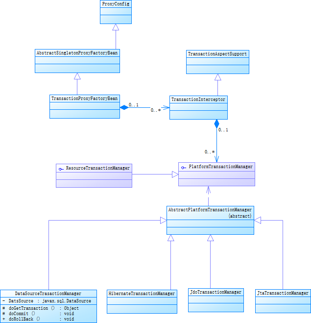

# Spring 事务管理处理的实现
本次探究只是针对单个数据库局部事务的处理。

Spring借助IoC容器强大的配置能力，为应用提供了声明式的事务划分方式，这种声明式的事务处理，为Spring应用使用事务管理提供了统一的方式。应用能够快速完成复杂的事务处理工作，从而为用户使用事务提供了很大的方便

# 1 Spring事务处理的设计概览

从图中可以看出：Spring事务处理模块是通过**AOP功能**来实现声明式事务的，比如事务属性的配置和读取，事务对象的抽象等。因此，在一个Spring事务处理中，可以通过设计一个**TransactionProxyFactoryBean**来使用这个AOP功能，通过这个TransactionProxyFactoryBean可以生成Proxy代理的对象，在这个对象中，通过**TransactionInterceptor**来完成对代理方法的拦截，正是这些AOP拦截功能，将事务处理的功能编织进来。在Spring事务处理中，在实现声明式事务处理时，这是AOP和IoC模块的集成部分。对于具体的事务处理实现方式，比如事务的生成、提交、回滚、挂起等，由于不同的底层数据库有不同的支持方式，因此在Spring事务处理中，对主要的事务实现做了一个抽象的适配。适配的具体事务处理器包括：

+ DataSourceTransactionManager：对DataSource数据源的事务处理支持
+ HibernateTransactionManager
+ JdoTransactionManager
+ JPATransactionManager
+ JTATransactionManager

这一系列的事务处理支持，同时通过** PlatformTransactionManager、AbstractPlatforTransactionManager以及一系列具体事务处理器 **来实现的，而PlatformTransactionManager又实现了TransactionInterceptor接口，通过这样一个接口实现设计，就把一系列事务处理的实现与前面的TransactionProxyFactoryBean结合起来，从而形成了一个Spring声明式事务处理的设计体系

# 2 Spring 声明式事务处理实现分析

## 2.1 启动事务
在使用声明式事务处理的时候，需要在IoC容器中配置TransactionManagerProxyFactryBean，在IoC容器进行注入的时候，会创建TransactionInterceptor对象，而这个对象会创建一个TransactionAttributitePointCut，为读取TransactionAttribute做准备。事务的提交就是在TransactionInterceptor的invoked()方法中实现的。

## 2.2 事务提交
在TransactionInterceptor的invoke方法中，通过PlatformTransactionManger事务处理器来实现事务的创建、提交、回滚操作。事务提交：commitTransactionAfterReturning(txInfo);但真正提交的入口是AbstractPlatformTransactionManger的doCommit()和doRollback()方法。DataSourceTransactionManger的实现时序图如下：

对数据库而言，事务工作是由Connection来完成，因此，把数据库的connection对象放到一个Connection Holder中，然后封装到一个DataSourceTransactionObject对象中，在这个封装过程中添加了许多事务控制服务的控制数据。

为了事务的隔离，spring事务是将connection放到Thread Local中。

# 3 Spring事务的传播属性
Spring在TransactionDefination接口中规定了7种类型的传播属性，它们规定了事务方法和事务方法发生嵌套调用时事务如何进行传播：

|事务传播行为类型|说明|
| ----- | -----|
|PROPAGATION_REQUIRED| 如果当前没有事务，就新建一个事务，如果存在事务，加入这个事务，如果事务发生异常，则一起回滚。|
|PROPAGATION_SUPPORTS| 支持当前事务，如果没有事务，就以非事务方式执行|
|PROPAGATION_REQUIRED_NEW| 新建事务，如果当前存在事务，就把当前事务挂起|
|PROPAGATION_NOT_SUPPORTS| 以非事务方式执行操作，如果当前存在事务，把当前事务挂起|
|PROPAGATION_NEVER| 以非事务方式执行，如果当前存在事务，就抛出异常|
|PROPAGATION_NESTED| 如果当前存在事务，则在嵌套事务内执行。如果当前没有事务，就与Required操作一样|
