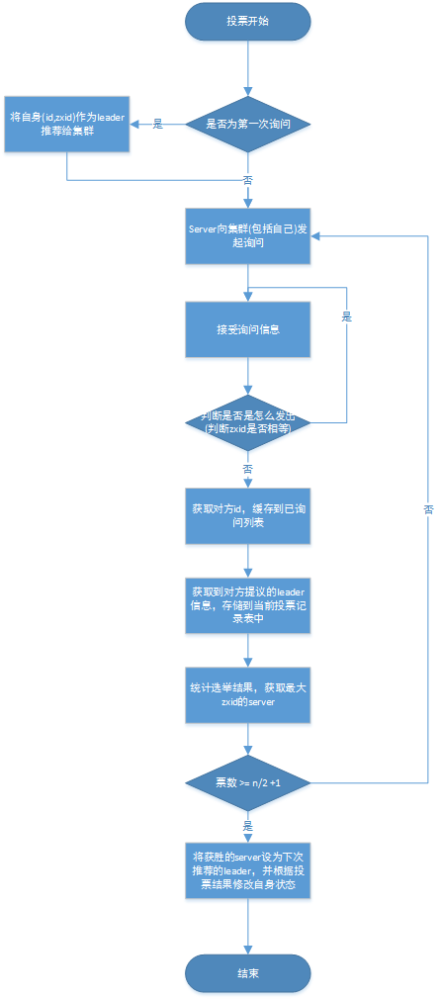

# Zookeeper的功能及原理
# 前言
最近在做sweet框架——一个基于spring boot开发、支持分布式架构的基础架构，其服务注册与发现中心是用zookeeper来实现的，我一直也在用，今天特此整理出来
# 1 Zookeeper是什么
ZooKeeper是一个分布式的，开源的分布式应用程序协调服务，是Google的Chubby一个开源的实现，它是集群的管理者，监视着集群中各个节点的状态根据节点提交的反馈进行下一步合理操作。
# 2 Zookeeper提供了什么功能
+ 文件系统
每个子目录都被称为znode，和文件系统一样，我们可以自由的增加和删除，在一个znode下增加和删除znode，znode也可以存储数据。znode有四种类型：

1、PERSISTENT：持久化目录节点。客户端与zookeeper的连接断开后，该节点依旧存在

2、PERSISTENT_SEQUENTIAL：持久化顺序编号目录节点。客户端与zookeeper连接断开后，该节点依旧存在，只是Zookeeper给该节点名末尾会自动追加一个10位数的单调递增的序号。

3、EPHEMERAL：临时目录节点。客户端与zookeeper的连接断开后，该节点自动被删除，临时节点不允许有子节点。

4、EPHEMRAL_SEQUENTIAL：临时目录节点。只是Zookeeper给该节点名末尾会自动追加一个10位数的单调递增的序号

+ 通知机制
客户端注册监听它关心的目录节点，当目录节点发生变化（数据改变、被删除、子目录节点增加/删除等）时，zookeeper会通知客户端。

# 3 Zookeeper做了什么
Zookeeper提供了**命名服务、配置管理、集群管理、分布式锁和队列管理**

1、命名服务

在Zookeeper的文件系统里创建一个目录，即有唯一的path。

2、配置管理

如果程序分散部署在多台机器上，要逐个改变配置还是比较困难的。现在把这些配置全部放到zookeeper上去，保存在 Zookeeper 的某个目录节点中，然后所有相关应用程序对这个目录节点进行监听，一旦配置信息发生变化，每个应用程序就会收到 Zookeeper 的通知，然后从 Zookeeper 获取新的配置信息应用到系统中就好了

3、集群管理
在一台机器上运营一个ZooKeeper实例，称之为单机（Standalone）模式。单机模式有个致命的缺陷，一旦唯一的实例挂了，依赖ZooKeeper的应用全得完蛋。

实际应用当中，一般都是采用集群模式来部署ZooKeeper，集群中的Server为奇数（2N+1）。只要集群中的多数（大于N+1台）Server活着，集群就能对外提供服务。

在每台机器上部署一个ZooKeeper实例，多台机器组成集群，称之为完全分布式集群。此外，还可以在仅有的一台机器上部署多个ZooKeeper实例，以伪集群模式运行。

集群配置，主要是在zk.cfg文件进行配置

**集群管理功能**：是否有机器退出/加入、选举master

+ 是否有机器退出：所有机器约定在父目录下创建临时目录节点，然后监听父目录节点变化消息。一般有机器挂掉，该机器与zookeeper的连接断开，如果session超时，则其所创建的临时节点被删除，所有其他机器都收到通知。
+ 是否有机器加入：所有机器收到通知，有节点接入。所有机器创建临时顺序编号目录节点，每次选取编号最小的机器为master。

4、分布式锁

有了Zookeeper的一致性文件系统，锁的问题就变得容易。锁服务可以分为两类，一个是保持独占，一个是控制时序。

+ 保持独占：我们将zookeeper上的一个znode看做是一把锁，通过create znode的方式来实现。所有客户端都去创建/distribute_lock节点，最终成功的那个客户端也就拥有了这把锁。用完删除。
+ 控制时序：/distribute_lock已经预先存在，所有客户端在它下面创建临时顺序编号目录节点，编号最小的获得锁，用完删除，依次循环。

5、Zookeeper队列管理

两种类型的队列：

1、同步队列，当一个队列的成员都聚齐时，这个队列才可用，否则一直等待所有成员到达。 

2、队列按照 FIFO 方式进行入队和出队操作。 

第一类，在约定目录下创建临时目录节点，监听节点数目是否是我们要求的数目。 

第二类，和分布式锁服务中的控制时序场景基本原理一致，入列有编号，出列按编号。

6、分布式与数据复制

Zookeeper作为一个集群提供一致的数据服务，自然，它要在所有机器间做数据复制。数据复制的好处： 

1、容错：一个节点出错，不致于让整个系统停止工作，别的节点可以接管它的工作； 

2、提高系统的扩展能力 ：把负载分布到多个节点上，或者增加节点来提高系统的负载能力； 

3、提高性能：让客户端本地访问就近的节点，提高用户访问速度。 

从客户端读写访问的透明度来看，数据复制集群系统分下面两种： 

1、写主(WriteMaster) ：对数据的修改提交给指定的节点。读无此限制，可以读取任何一个节点。这种情况下客户端需要对读与写进行区别，俗称读写分离； 

2、写任意(Write Any)：对数据的修改可提交给任意的节点，跟读一样。这种情况下，客户端对集群节点的角色与变化透明。

对zookeeper来说，它采用的方式是写任意。通过增加机器，它的读吞吐能力和响应能力扩展性非常好，而写，随着机器的增多吞吐能力肯定下降（这也是它建立observer的原因），而响应能力则取决于具体实现方式，是延迟复制保持最终一致性，还是立即复制快速响应。

# 4 Zookeeper的设计目的
* 最终一致性：client无论连接到哪个server，展示给它的都是同一个视图，这是zookeeper最重要的性能
* 可靠性：具有简单、健壮、良好的性能，如果消息被一台服务器接受，那么它将被所有机器接受
* 实时性：Zookeeper保证客户端将在一段时间范围内获得服务器的更新信息，或者服务器失效的信息。但由于网络延迟等原因，Zookeeper不能保证两个客户端同时得到更新，如果需要最新数据，应该在读取数据之前调用sync()接口
* 等待无关：慢的或者失效的client不得干预快速的client请求，使得每个client都能有效的等待
* 原子性：更新只能成功或者失败，没有中间状态
* 顺序性：包括全局有序和偏序两种。

# 5 Zookeeper工作原理
Zookeeper的核心是原子广播，这个机制保证了各个Server之间的同步。实现这个机制的协议叫Zab协议。Zab协议有两种模式：恢复模式和广播模式。当服务启动或者在领导者崩溃后，Zab就进入了恢复模式，当领导者被选举出来，且大多数Server完成了和leader的状态同步后，恢复模式就结束了。状态同步保证了leader和Server具有相同的系统状态。

为了保证事务的顺序一致性，zookeeper采用了递增的事务id号（zxid）来标识事务。所有的提议proposal都在被提出的时候加上了zxid。实现zxid的是一个64位的数字，它高32位是epoch用来标识leader关系是否改变，每一次leader被选出来，她都会有一个新的epoch。低32位用于递增计数。

# 6 Zookeeper选举过程
当leader崩溃或者leader失去大多数的follower，这时候zk进入恢复模式，恢复模式需要重新选举出一个新的leader，让所有的Server都恢复到一个正确的状态。

Zk的选举算法有两种：一种是基于basic paxos实现的，另外一种是基于fast paxos算法实现的。系统默认的选举算法为fast paxos。

## 6.1 basic paxos 
* 选举线程由当前Server发起选举的线程担任，其主要功能是对投票结果进行统计，并选出推荐的Server
* 选举线程首先向所有Server发起一次询问（包括自己）
* 选举线程收到回复后，验证是否是自己发出的询问（验证zxid是否一致），然后获取对方的id（myid），并存储到当前询问对象列表中，最后获取对方提议的leader相关信息（id，zxid），并将这些信息存储到档次选举的投票记录表中。
* 收到所有server回复，就计算出zxid最大的那个Server，并将这个Server相关信息设置成下一次投票的Server；
* 线程将当前zxid最大的Server设置为当前Server要推荐的Leader，如果此时获胜的Server获取n/2 + 1的Server票数，则获胜，否则继续这个过程，直到leader被选举出来。

在恢复模式下，如果是刚从崩溃状态恢复的或者刚启动的server还会从磁盘快照中恢复数据和会话信息，zk会记录事务日志并定期进行快照，方便在恢复时进行状态恢复。

## 6.2 fast paxos 
fast paxos流程是在选举过程中，某Server首先向所有Server提议自己要成为leader，当其它Server收到提议以后，解决epoch和 zxid的冲突，并接受对方的提议，然后向对方发送接受提议完成的消息，重复这个流程，最后一定能选举出Leader。

## 6.3 同步流程
选举完leader后，zk就进入了同步过程

* leader等待server连接
* Follower连接leader，将最大的zxid发送给leader
* leader根据follower的指定确定同步点
* 完成同步后通知follower已变成update状态
* Follower接到update消息后，又可以重新接受client的请求进行服务了。
