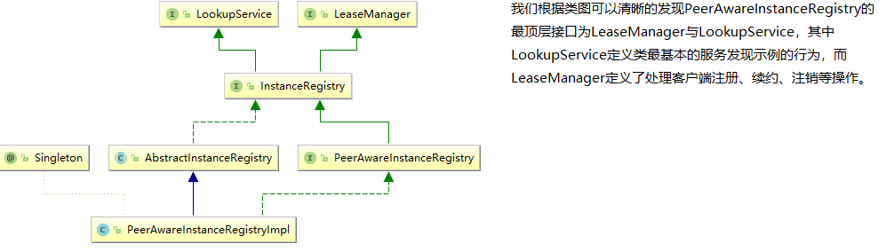

**目录** 

+ [服务治理](#服务治理)
+ [创建服务注册中心](#创建服务注册中心)
+ [创建服务提供者](#创建服务提供者)
+ [高可用服务注册中心](#高可用注册中心)
+ [Eureka详解](#Eureka详解)

# 服务治理：Spring Cloud Eureka

Spring Cloud Eureka是Spring Cloud Netflix微服务套件中的一部分，它基于Netflix Eureka做了二次封装，主要负责完成微服务架构中的服务治理功能。
Netflix Eureka既包含了服务端组件，也包含了客户端组件。

**Eureka服务端**：也成为服务注册中心，它同其他服务注册中心一样，支持高可用配置。如果Eureka以集群模式进行部署，当集权中有分片出现故障时，那么Eureka就转入自我保护模式。它允许在分片故障期间继续提供服务的发现和注册，当分片故障恢复运行时，集群中的其他分片会把它们的状态再次同步回来。以在AWS上的实践为例，Netflix推荐每个可用的区域运行一个Eureka服务端，通过它来形成集群。不同可用区域的服务注册中心通过异步模式互相复制各自的状态，这意味着任意给定的时间点，每个实例关于所有服务的状态是有细微差别的。

**Eureka客户端**：主要处理服务的注册与发现。客户端通过注解和参数配置的方式，嵌入在客户端应用程序的代码中，在应用程序运行期间，Eureka客户端向注册中心注册自身提供的服务并周期性地发送心跳来更新它的服务租约。同时，它也能从服务端查询当前注册的服务信息并把它们缓存到本地并周期性地刷新服务状态。

## 服务治理
服务治理是微服务架构中最为核心和基础的模块，它主要用来实现各个微服务实例的自动化注册和发现。
### 服务注册
在服务治理框架中，通常会构建一个注册中心，每个服务单元向注册中心登记自己提供的服务，将主机与端口、版本号、通信协议等一些附加信息告知注册中心，注册中心按照**服务名**组织服务清单。并且服务注册中心还需要以**心跳**的方式去监测清单中的服务是否可用，若不可用需要从服务清单中剔除，达到排除故障的效果。

|服务名|位置|
| ------ | ------|
|服务A|192.168.1.1:8000、192.168.1.2:8001|
|服务B|192.168.1.3:8003、192.168.1.4:8004|

#### 服务发现
由于在服务治理框架下运作，服务间的调用不再通过指定具体的实例地址来实现，而是通过向服务名发起请求调用实现。所以，服务调用方在调用服务提供方接口的时候，并不知道具体的实例位置。因此，调用方需要向服务注册中心咨询服务，并获取所有服务的实例清单，以实现对具体服务实例的访问。
## 创建服务注册中心

* 创建Maven项目，并引入一下pom

```xml
<?xml version="1.0" encoding="UTF-8"?>
<project xmlns="http://maven.apache.org/POM/4.0.0" xmlns:xsi="http://www.w3.org/2001/XMLSchema-instance" xsi:schemaLocation="http://maven.apache.org/POM/4.0.0 http://maven.apache.org/xsd/maven-4.0.0.xsd">
    <parent>
        <artifactId>mermaid-framework-parent</artifactId>
        <groupId>com.mermaid.framework</groupId>
        <version>1.0-SNAPSHOT</version>
    </parent>
    <modelVersion>4.0.0</modelVersion>
    <artifactId>mermaid-eureka-server</artifactId>
    <name>mermaid-eureka-server</name>
    <properties>
        <project.build.sourceEncoding>UTF-8</project.build.sourceEncoding>
        <maven.compiler.source>1.7</maven.compiler.source>
        <maven.compiler.target>1.7</maven.compiler.target>
    </properties>
    <dependencies>
        <dependency>
            <groupId>org.springframework.cloud</groupId>
            <artifactId>spring-cloud-starter-eureka-server</artifactId>
        </dependency>
    </dependencies>
    <dependencyManagement>
        <dependencies>
            <dependency>
                <groupId>org.springframework.cloud</groupId>
                <artifactId>spring-cloud-dependencies</artifactId>
                <version>Dalston.RELEASE</version>
                <type>pom</type>
                <scope>import</scope>
            </dependency>
        </dependencies>
    </dependencyManagement>
</project>
```

* 启动一个注册中心，只需要在Spring Boot的启动类上添加一个注解@EnableEurekaServer即可
```
@SpringBootApplication
@EnableEurekaServer
public class EurekaServerApplication {
    public static void main(String[] args) {
        SpringApplication.run( EurekaServerApplication.class, args );
    }
}
```

eureka是一个高可用的组件，它没有后端缓存，每一个实例注册之后需要向注册中心发送心跳（因此可以在内存中完成），在默认情况下erureka server也是一个eureka client ,必须要指定一个 server。eureka server的配置文件appication.yml：
```
server:
  port: 8761

eureka:
  instance:
    hostname: localhost
## 通过eureka.client.registerWithEureka：false和fetchRegistry：false来表明自己是一个eureka server.
  client:
    registerWithEureka: false
    ## 由于注册中心的职责就是维护服务实例，它并不需要去检索服务
    fetchRegistry: false
    serviceUrl:
      defaultZone: http://${eureka.instance.hostname}:${server.port}/eureka/

spring:
  application:
    name: eurka-server
```

* Eureka SERVER是有界面的，启动工程，访问http://localhost:8761 ,界面如下：


### 创建服务提供者
当client向server注册时，它会提供一些元数据，例如主机和端口，URL，主页等。Eureka server从每个client实例接收心跳消息。如果心跳超时，则通常将该实例从注册server中删除。
```xml
<?xml version="1.0" encoding="UTF-8"?>
<project xmlns="http://maven.apache.org/POM/4.0.0" xmlns:xsi="http://www.w3.org/2001/XMLSchema-instance"
         xsi:schemaLocation="http://maven.apache.org/POM/4.0.0 http://maven.apache.org/xsd/maven-4.0.0.xsd">
    <modelVersion>4.0.0</modelVersion>
    <groupId>com.forezp</groupId>
    <artifactId>service-hi</artifactId>
    <version>0.0.1-SNAPSHOT</version>
    <packaging>jar</packaging>
    <name>service-hi</name>
    <description>Demo project for Spring Boot</description>
    <parent>
        <groupId>com.forezp</groupId>
        <artifactId>sc-f-chapter1</artifactId>
        <version>0.0.1-SNAPSHOT</version>
    </parent>
    <dependencies>
        <dependency>
            <groupId>org.springframework.cloud</groupId>
            <artifactId>spring-cloud-starter-netflix-eureka-client</artifactId>
        </dependency>
        <dependency>
            <groupId>org.springframework.boot</groupId>
            <artifactId>spring-boot-starter-web</artifactId>
        </dependency>
    </dependencies>
    <build>
        <plugins>
            <plugin>
                <groupId>org.springframework.boot</groupId>
                <artifactId>spring-boot-maven-plugin</artifactId>
            </plugin>
        </plugins>
    </build>
</project>
```

通过注解@EnableEurekaClient 表明自己是一个eurekaclient.

```
@SpringBootApplication
@EnableEurekaClient
@RestController
public class ServiceHiApplication {
    public static void main(String[] args) {
        SpringApplication.run( ServiceHiApplication.class, args );
    }
    @Value("${server.port}")
    String port;
    @RequestMapping("/hi")
    public String home(@RequestParam(value = "name", defaultValue = "forezp") String name) {
        return "hi " + name + " ,i am from port:" + port;
    }
}
```

仅仅@EnableEurekaClient是不够的，还需要在配置文件中注明自己的服务注册中心的地址,application.yml配置文件如下：

```
server:
  port: 8762
spring:
  application:
    name: service-hi
eureka:
  client:
    serviceUrl:
      defaultZone: http://localhost:8761/eureka/
```

**需要指明spring.application.name**,这个很重要，这在以后的服务与服务之间相互调用一般都是根据这个name 。 启动工程，打开http://localhost:8761 


你会发现一个服务已经注册在服务中了，服务名为SERVICE-HI ,端口为7862

这时打开 http://localhost:8762/hi?name=forezp ，你会在浏览器上看到 :

hi forezp,i am from port:8762

## 高可用注册中心
Eureka Server的高可用实际上是将自己作为服务向其他注册中心注册自己，这样就可以形成一组相互注册的服务注册中心，以实现服务器清单的相互同步，达到高可用的效果


从图可以看出在这个体系中，有2个角色，即Eureka Server和Eureka Client。而Eureka Client又分为Applicaton Service和Application Client，即服务提供者何服务消费者。 每个区域有一个Eureka集群，并且每个区域至少有一个eureka服务器可以处理区域故障，以防服务器瘫痪。

Eureka Client向Eureka Serve注册，并将自己的一些客户端信息发送Eureka Serve。然后，Eureka Client通过向Eureka Serve发送心跳（每30秒）来续约服务的。 如果客户端持续不能续约，那么，它将在大约90秒内从服务器注册表中删除。 注册信息和续订被**复制**到集群中的Eureka Serve所有节点。 来自任何区域的Eureka Client都可以查找注册表信息（每30秒发生一次）。根据这些注册表信息，Application Client可以远程调用Applicaton Service来消费服务。

## Eureka详解
构建了Eureka服务治理体系中的三个核心角色：服务注册中心、服务提供者和服务消费者。
+ 服务提供者
    - 服务发现
服务提供者在启动的时候会通过发送REST请求的方式将自己注册到Eureka Server上，同时带上了自身服务的一些元数据。Eureka Server在接到这个REST请求后，将元数据信息存储在一个双层结构Map中。其中第一层的key是服务名，第二层的key是具体服务的实例名。
    - 服务同步
当有多个服务注册中心时，服务提供者会分别注册到两个不同的服务注册中心上。此时，由于服务注册中心之间因为互相注册为服务，当服务提供者发送注册请求到一个服务注册中心时，它会将该请求转发给集群中相连的其他注册中心，从而实现注册中心之间的服务同步
    - 服务续约
在注册完成服务之后，服务提供者会维护一个心跳来持续告诉Eureka Server标识自己还活跃。以防止Eureka Server的剔除任务将该服务实例从服务列表中剔除。服务续约任务的调用间隔是30秒。定义服务失效的间隔是90秒。 
+ 服务消费者
    - 获取服务
当我们启动服务消费者的时候，它会发送一个REST请求给服务注册中心，来获取上面注册的服务清单。eureka server维护一份只读的服务清单来返回给客户端，同时该缓存会每隔30秒更新一次。
可以修改参数eureka.client.registry-fetch-interval-seconds=30这个参数进行修改时间间隔，单位是秒。
    - 服务调用
服务消费者在获取服务清单后，通过服务名可以获取具体提供服务的实例名和该实例的元数据信息。在Ribbon中，默认采用轮询的方式进行调用，从而实现客户端的负载均衡。
    - 服务下线
当服务进行正常的关闭操作时，它会触发一个服务下线的REST请求到Eureka Server。服务端在接收到请求后，将该服务状态设置为下线（DOWN）。
+ 服务注册中心
    - 失效剔除
Eureka Server在启动时会创建一个定时任务，默认每隔一段时间就将当前清单中超过90秒没有续约的服务剔除出去。
    - 自我保护
不建议使用

## Eureka注册过程分析
### Eureka服务端
Eureka的服务端的核心类是EurekaBootStrap，该类实现了一个ServletContextListener的监听器，因此我们可以断定eureka是基于servlet容器实现的。在容器启动之初，调用ServletContextListener的contextInitialized方法，其关键代码如下：
```java
public class EurekaBootStrap implements ServletContextListener {
	//省略代码...
	@Override
    public void contextInitialized(ServletContextEvent event) {
        try {
        	//初始化Eureka环境
            initEurekaEnvironment();
            //初始化EurekaServerContext
            initEurekaServerContext();

            ServletContext sc = event.getServletContext();
            sc.setAttribute(EurekaServerContext.class.getName(), serverContext);
        } catch (Throwable e) {
            logger.error("Cannot bootstrap eureka server :", e);
            throw new RuntimeException("Cannot bootstrap eureka server :", e);
        }
    }
}

protected void initEurekaServerContext() throws Exception {
        //省略代码...
        ApplicationInfoManager applicationInfoManager = null;

        if (eurekaClient == null) {
            EurekaInstanceConfig instanceConfig = isCloud(ConfigurationManager.getDeploymentContext())
                    ? new CloudInstanceConfig()
                    : new MyDataCenterInstanceConfig();
            
            applicationInfoManager = new ApplicationInfoManager(
                    instanceConfig, new EurekaConfigBasedInstanceInfoProvider(instanceConfig).get());
            
            EurekaClientConfig eurekaClientConfig = new DefaultEurekaClientConfig();
            eurekaClient = new DiscoveryClient(applicationInfoManager, eurekaClientConfig);
        } else {
            applicationInfoManager = eurekaClient.getApplicationInfoManager();
        }

        PeerAwareInstanceRegistry registry;
        if (isAws(applicationInfoManager.getInfo())) {
            registry = new AwsInstanceRegistry(
                    eurekaServerConfig,
                    eurekaClient.getEurekaClientConfig(),
                    serverCodecs,
                    eurekaClient
            );
            awsBinder = new AwsBinderDelegate(eurekaServerConfig, eurekaClient.getEurekaClientConfig(), registry, applicationInfoManager);
            awsBinder.start();
        } else {
            registry = new PeerAwareInstanceRegistryImpl(
                    eurekaServerConfig,
                    eurekaClient.getEurekaClientConfig(),
                    serverCodecs,
                    eurekaClient
            );
        }

        PeerEurekaNodes peerEurekaNodes = getPeerEurekaNodes(
                registry,
                eurekaServerConfig,
                eurekaClient.getEurekaClientConfig(),
                serverCodecs,
                applicationInfoManager
        );

        serverContext = new DefaultEurekaServerContext(
                eurekaServerConfig,
                serverCodecs,
                registry,
                peerEurekaNodes,
                applicationInfoManager
        );

        EurekaServerContextHolder.initialize(serverContext);

        serverContext.initialize();
        logger.info("Initialized server context");

        // Copy registry from neighboring eureka node
        int registryCount = registry.syncUp();
        registry.openForTraffic(applicationInfoManager, registryCount);

        // Register all monitoring statistics.
        EurekaMonitors.registerAllStats();
    }
```
在方法initEurekaServletContext()方法中会创建很多与eureka服务相关的对象，两个核心对象分别是EurekaClient和PeerAwareInstanceRegistry。其中PeerAwareInstanceRegistry的类图如下：



那么PeerAwareInstanceRegistry这个类用于多个节点复制相关信息，比如说一个节点注册续约与下线，那么这个类将会把相关复制（通知）到各个节点。

```java
// com.netflix.eureka.registry.PeerAwareInstanceRegistryImpl#register
@Override
    public void register(final InstanceInfo info, final boolean isReplication) {
    	//获取默认的定义服务失效的时间90s
        int leaseDuration = Lease.DEFAULT_DURATION_IN_SECS;
        if (info.getLeaseInfo() != null && info.getLeaseInfo().getDurationInSecs() > 0) {
            leaseDuration = info.getLeaseInfo().getDurationInSecs();
        }
        //调用父类的register方法，然后又通过replicationToPeers复制对应的行为到其他节点
        super.register(info, leaseDuration, isReplication);
        replicateToPeers(Action.Register, info.getAppName(), info.getId(), info, null, isReplication);
    }

//PeerAwareInstanceRegistyImpl的服务类的register方法 com.netflix.eureka.registry.AbstractInstanceRegistry#register
public void register(InstanceInfo registrant, int leaseDuration, boolean isReplication) {
        try {
            read.lock();
            //根据AppName获取相关的服务实例对象
            Map<String, Lease<InstanceInfo>> gMap = registry.get(registrant.getAppName());
            //EurekaMonitor的注册行为加1
            REGISTER.increment(isReplication);
            //如果为Null，则创建一个新的map，并把当前的注册应用程序信息添加到此Map中。
            //这里有个Lease对象，这个类描述了泛型T的时间属性，比如注册时间、服务启动时间、最后更新时间等。
            if (gMap == null) {
                final ConcurrentHashMap<String, Lease<InstanceInfo>> gNewMap = new ConcurrentHashMap<String, Lease<InstanceInfo>>();
                gMap = registry.putIfAbsent(registrant.getAppName(), gNewMap);
                if (gMap == null) {
                    gMap = gNewMap;
                }
            }

            //根据当前注册的ID，获取Lease对象信息
            Lease<InstanceInfo> existingLease = gMap.get(registrant.getId());
            // Retain the last dirty timestamp without overwriting it, if there is already a lease
            //如果能在gMap中获取
            if (existingLease != null && (existingLease.getHolder() != null)) {
                Long existingLastDirtyTimestamp = existingLease.getHolder().getLastDirtyTimestamp();
                Long registrationLastDirtyTimestamp = registrant.getLastDirtyTimestamp();
                logger.debug("Existing lease found (existing={}, provided={}", existingLastDirtyTimestamp, registrationLastDirtyTimestamp);

                //根据当前存在节点的触碰时间和注册节点的触碰时间的比较，如果前者晚于后者，则当前注册的实例就以已存在的实例为准
                if (existingLastDirtyTimestamp > registrationLastDirtyTimestamp) {
                    logger.warn("There is an existing lease and the existing lease's dirty timestamp {} is greater" +
                            " than the one that is being registered {}", existingLastDirtyTimestamp, registrationLastDirtyTimestamp);
                    logger.warn("Using the existing instanceInfo instead of the new instanceInfo as the registrant");
                    registrant = existingLease.getHolder();
                }
            } else {
            	// 更新其每分钟期望的续约数量和阈值
                // The lease does not exist and hence it is a new registration
                synchronized (lock) {
                    if (this.expectedNumberOfRenewsPerMin > 0) {
                        // Since the client wants to cancel it, reduce the threshold
                        // (1
                        // for 30 seconds, 2 for a minute)
                        this.expectedNumberOfRenewsPerMin = this.expectedNumberOfRenewsPerMin + 2;
                        this.numberOfRenewsPerMinThreshold =
                                (int) (this.expectedNumberOfRenewsPerMin * serverConfig.getRenewalPercentThreshold());
                    }
                }
                logger.debug("No previous lease information found; it is new registration");
            }

            //将当前的注册节点存到Map中
            Lease<InstanceInfo> lease = new Lease<InstanceInfo>(registrant, leaseDuration);
            if (existingLease != null) {
                lease.setServiceUpTimestamp(existingLease.getServiceUpTimestamp());
            }
            gMap.put(registrant.getId(), lease);
            synchronized (recentRegisteredQueue) {
                recentRegisteredQueue.add(new Pair<Long, String>(
                        System.currentTimeMillis(),
                        registrant.getAppName() + "(" + registrant.getId() + ")"));
            }
            // This is where the initial state transfer of overridden status happens
            if (!InstanceStatus.UNKNOWN.equals(registrant.getOverriddenStatus())) {
                logger.debug("Found overridden status {} for instance {}. Checking to see if needs to be add to the "
                                + "overrides", registrant.getOverriddenStatus(), registrant.getId());
                if (!overriddenInstanceStatusMap.containsKey(registrant.getId())) {
                    logger.info("Not found overridden id {} and hence adding it", registrant.getId());
                    overriddenInstanceStatusMap.put(registrant.getId(), registrant.getOverriddenStatus());
                }
            }
            InstanceStatus overriddenStatusFromMap = overriddenInstanceStatusMap.get(registrant.getId());
            if (overriddenStatusFromMap != null) {
                logger.info("Storing overridden status {} from map", overriddenStatusFromMap);
                registrant.setOverriddenStatus(overriddenStatusFromMap);
            }

            // Set the status based on the overridden status rules
            InstanceStatus overriddenInstanceStatus = getOverriddenInstanceStatus(registrant, existingLease, isReplication);
            registrant.setStatusWithoutDirty(overriddenInstanceStatus);

            // If the lease is registered with UP status, set lease service up timestamp
            if (InstanceStatus.UP.equals(registrant.getStatus())) {
                lease.serviceUp();
            }
            registrant.setActionType(ActionType.ADDED);
            recentlyChangedQueue.add(new RecentlyChangedItem(lease));
            registrant.setLastUpdatedTimestamp();
            invalidateCache(registrant.getAppName(), registrant.getVIPAddress(), registrant.getSecureVipAddress());
            logger.info("Registered instance {}/{} with status {} (replication={})",
                    registrant.getAppName(), registrant.getId(), registrant.getStatus(), isReplication);
        } finally {
            read.unlock();
        }
    }
```
### Eureka客户端
在服务端ServletContextListener初始化完毕时，会创建DiscoveryClient。
```java
protected void initEurekaServerContext() throws Exception {
       	//省略代码...
        if (this.eurekaClient == null) {
            registry = this.isCloud(ConfigurationManager.getDeploymentContext()) ? new CloudInstanceConfig() : new MyDataCenterInstanceConfig();
            applicationInfoManager = new ApplicationInfoManager((EurekaInstanceConfig)registry, (new EurekaConfigBasedInstanceInfoProvider((EurekaInstanceConfig)registry)).get());
            EurekaClientConfig eurekaClientConfig = new DefaultEurekaClientConfig();
            //创建DiscoveryClient
            this.eurekaClient = new DiscoveryClient(applicationInfoManager, eurekaClientConfig);
        } else {
            applicationInfoManager = this.eurekaClient.getApplicationInfoManager();
        }

        if (this.isAws(applicationInfoManager.getInfo())) {
            registry = new AwsInstanceRegistry(eurekaServerConfig, this.eurekaClient.getEurekaClientConfig(), serverCodecs, this.eurekaClient);
            this.awsBinder = new AwsBinderDelegate(eurekaServerConfig, this.eurekaClient.getEurekaClientConfig(), (PeerAwareInstanceRegistry)registry, applicationInfoManager);
            this.awsBinder.start();
        } else {
            registry = new PeerAwareInstanceRegistryImpl(eurekaServerConfig, this.eurekaClient.getEurekaClientConfig(), serverCodecs, this.eurekaClient);
        }

        //省略代码...
    }

//从DiscoveryClient的构造器中可以看出，如果fetchReigistry与registryWithEureka都不为false，那么启动就会报错。
 @Inject
    DiscoveryClient(ApplicationInfoManager applicationInfoManager, EurekaClientConfig config, AbstractDiscoveryClientOptionalArgs args, Provider<BackupRegistry> backupRegistryProvider) {
        //省略代码...
        if (!config.shouldRegisterWithEureka() && !config.shouldFetchRegistry()) {
        	//当这两个属性都为false时，不会启动定时任务和心跳
            logger.info("Client configured to neither register nor query for data.");
            this.scheduler = null;
            this.heartbeatExecutor = null;
            this.cacheRefreshExecutor = null;
            this.eurekaTransport = null;
            this.instanceRegionChecker = new InstanceRegionChecker(new PropertyBasedAzToRegionMapper(config), this.clientConfig.getRegion());
            DiscoveryManager.getInstance().setDiscoveryClient(this);
            DiscoveryManager.getInstance().setEurekaClientConfig(config);
            this.initTimestampMs = System.currentTimeMillis();
            logger.info("Discovery Client initialized at timestamp {} with initial instances count: {}", this.initTimestampMs, this.getApplications().size());
        } else {
            try {
                this.scheduler = Executors.newScheduledThreadPool(2, (new ThreadFactoryBuilder()).setNameFormat("DiscoveryClient-%d").setDaemon(true).build());
                this.heartbeatExecutor = new ThreadPoolExecutor(1, this.clientConfig.getHeartbeatExecutorThreadPoolSize(), 0L, TimeUnit.SECONDS, new SynchronousQueue(), (new ThreadFactoryBuilder()).setNameFormat("DiscoveryClient-HeartbeatExecutor-%d").setDaemon(true).build());
                this.cacheRefreshExecutor = new ThreadPoolExecutor(1, this.clientConfig.getCacheRefreshExecutorThreadPoolSize(), 0L, TimeUnit.SECONDS, new SynchronousQueue(), (new ThreadFactoryBuilder()).setNameFormat("DiscoveryClient-CacheRefreshExecutor-%d").setDaemon(true).build());
                this.eurekaTransport = new DiscoveryClient.EurekaTransport(null);
                this.scheduleServerEndpointTask(this.eurekaTransport, args);
                Object azToRegionMapper;
                if (this.clientConfig.shouldUseDnsForFetchingServiceUrls()) {
                    azToRegionMapper = new DNSBasedAzToRegionMapper(this.clientConfig);
                } else {
                    azToRegionMapper = new PropertyBasedAzToRegionMapper(this.clientConfig);
                }

                if (null != this.remoteRegionsToFetch.get()) {
                    ((AzToRegionMapper)azToRegionMapper).setRegionsToFetch(((String)this.remoteRegionsToFetch.get()).split(","));
                }

                this.instanceRegionChecker = new InstanceRegionChecker((AzToRegionMapper)azToRegionMapper, this.clientConfig.getRegion());
            } catch (Throwable var9) {
                throw new RuntimeException("Failed to initialize DiscoveryClient!", var9);
            }

            //省略部分代码
            this.initScheduledTasks();

            //省略部分代码...
        }
    }
```

通过源码分析，我们可以得出结论：
1）如果shouldRegisterWithEureka与shouldFetchRegistry都为false,那么直接return。

2）创建发送心跳与刷新缓存的线程池

3）初始化创建的定时任务