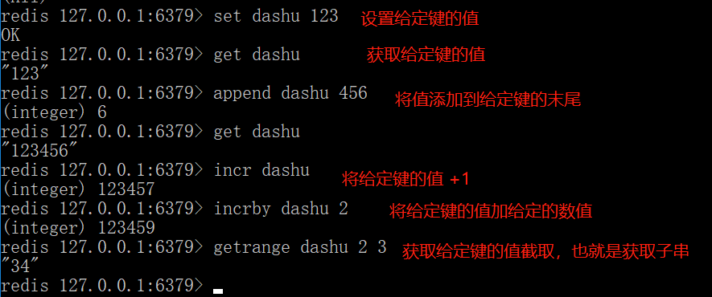
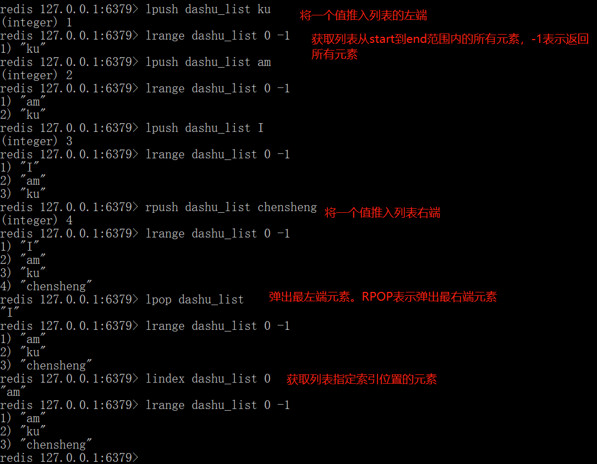
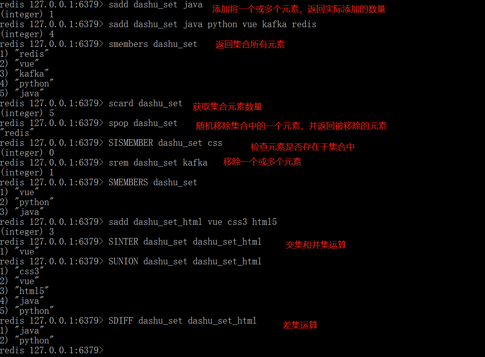
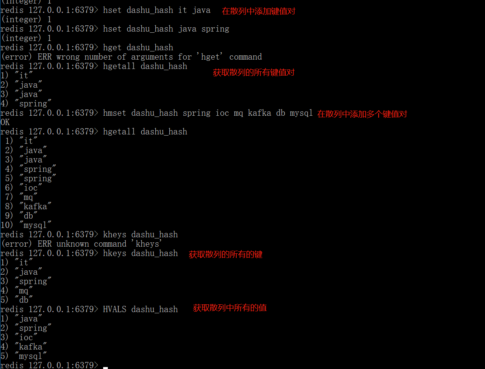
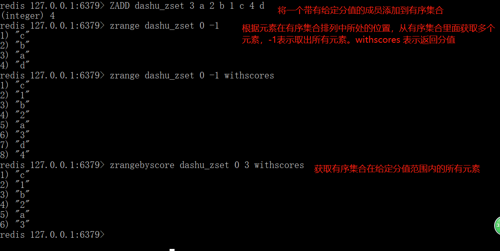

# 缓存
用缓存，主要有两个用途：高性能、高并发

**高性能**

假设这么个场景，你有个操作，一个请求过来，吭哧吭哧你各种乱七八糟操作mysql，半天查出来一个结果，耗时600ms。但是这个结果可能接下来几个小时都不会变了，或者变了也可以不用立即反馈给用户。那么此时咋办？**缓存啊**，折腾600ms查出来的结果，扔缓存里，一个key对应一个value，下次再有人查，别走mysql折腾600ms了，直接从缓存里，通过一个key查出来一个value，2ms搞定。性能提升300倍。

就是说对于一些需要复杂操作耗时查出来的结果，且确定后面不怎么变化，但是有很多读请求，那么直接将查询出来的结果放在缓存中，后面直接读缓存就好。

**高并发**

mysql这么重的数据库，压根儿设计不是让你玩儿高并发的，虽然也可以玩儿，但是天然支持不好。mysql单机支撑到**2000QPS**也开始容易报警了。

所以要是你有个系统，高峰期一秒钟过来的请求有1万，那一个mysql单机绝对会死掉。你这个时候再不进行数据库集群的情况下，上缓存，把很多数据放缓存，别访问mysql。缓存功能简单，说白了就是key-value式操作，单机支撑的并发量轻松一秒几万十几万，支撑高并发so easy。单机承载并发量是mysql单机的几十倍。

```
缓存是走内存的，内存天然就支撑高并发。
```

## 缓存选型
目前一般用的缓存是redis和memcached。各大BBS上都有这两项比对。这里只简单说明一下：

+ Redis支持复杂的数据结构

redis 相比 memcached 来说，拥有更多的数据结构，能支持更丰富的数据操作。如果需要缓存能够支持更复杂的结构和操作， redis 会是不错的选择。

+ redis 原生支持集群模式

redis3.x版本以后，支持cluster模式，而 memcached 没有原生的集群模式，需要依靠客户端来实现往集群中分片写入数据。redis开发难度低

+ 性能比对

Redis性能极高：Redis能读的速度是110000次/s,写的速度是81000次/s 。

由于redis只使用单核，而 memcached 可以使用多核，所以平均每一个核上redis在存储小数据时比 memcached 性能更高。而在100k以上的数据中，memcached性能要高于redis，虽然redis最近也在存储大数据的性能上进行优化，但是比起memcached，还是稍有逊色。


# 什么是Redis
Redis是完全开源的、基于内存的、高性能键值对数据库。它具备以下特性：
+ 丰富的存储结构

到目前为止Redis提供了5种不同的数据结构：
- 字符串String
- 列表 List
- 集合 Set
- 散列 Hash
- 有序集合 Zset

Redis还支持 publish/subscribe, 通知, key 过期等等特性。

+ 内存存储和持久化

Redis数据库中的所有数据都存储在内存中。由于内存的读写速度远快于硬盘，因此Redis在性能上对比基于硬盘的数据库有非常明显优势。除此之外，Redis支持复制和持久化以及客户端分片，用户很方便地就可以将Redis扩展。

# [Redis安装](http://www.runoob.com/redis/redis-install.html)

# Redis 基本命令

## 1.字符串String
在Redis里，字符串可以存储以下3种类型的值
* 字符串
* 整数
* 浮点数
用户可以通过给定一个任意的数值，对存储着整数或浮点数的字符串执行自增或者自减操作。

Redis中字符串操作命令

|命令|描述|
| ---- | ---- |
|GET key|获取存储在给定键中的值|
|SET key value|设置存储在给定键中的值|
|DEL key|删除给定键的值|
|INCR key|将键存储值+1|
|DECR key|将键存储值-1|
|APPNED key value|将值value追加到末尾|



## 2.列表List
redis列表允许用户从列表的两端推入或者弹出元素，以及执行各种常见的列表操作。除此之外，还可以作为阻塞队列使用。

|命令|用例和描述|
| ---- | ---- |
|RPUSH key item|将给定值推入列表右端|
|LPUSH key item|将给定值推入列表左端|
|RPOP key|从列表左端弹出元素|
|LPOP key|从列表右端弹出元素|
|LRANGE key start end|获取列表在给定范围上的所有值，-1表示取出所有元素|
|LINDEX key index|获取列表在给定位置上的单个元素|
|BLPOP key-name [key-name ...] timeout|从第一个非空列表中弹出最左端元素，或者在timeout秒内阻塞并等待可弹出的元素出现|




## 3.集合Set
Redis集合和列表的不同之处在于，列表可以存储多个相同的字符串，而集合通过使用散列来保证自己存储的每个字符串都是不同的。

|命令|用例和描述|
| ---- | ---- |
|SADD key item|将给定元素添加到集合|
|SMEMBERS key|返回集合包含的所有元素|
|SISMEMBER key item|检查给定元素是否存在与集合中|
|SREM key item|删除给定元素|
|SPOP key|随机地移除集合中一个元素，并返回|
|SDIFF key-name [key-name ...]|差集运算|
|SINTER key-name[key-name ...]|交集运算|
|SUNION key-name[key-name ...]|并集运算|



## 4.散列Hash
Redis的散列可以存储多个键值对之间的映射关系。存储结构类似于Map<hashKey,Map<subKey,item>>

|命令|用例和描述|
| ---- | ---- |
|HSET key subKey item|在散列里面关联给给定的键值对(新增)|
|HGET key subKey|获取指定散列键的值|
|HGETDETAIL key|获取散列包含的所有键值对|
|HDEL key subKey|删除元素|
|HMSET key-name key value [key value ...]|为散列里添加一个或多个键值对|
|HMGET key-name key [key ...]|从散列中获取一个或多个键的值|
|HKEYS key-name |获取散列中包含的所有的键|
|HVALS key-name |获取散列中包含的所有的值|



## 5.有序集合

|命令|用例和描述|
| ---- | ---- |
|ZADD key-name score member [score memeber ...]|将带有给定分值的成员添加到有序集合|
|ZREM key-name member|移除给定的成员|
|ZCARD key-name|返回有序集合包含的成员数量|
|ZRANGE key start stop [withscores]|返回有序集合中排名介于start和stop之间的成员。|



## 6.发布/订阅
订阅者（listener）负责订阅频道（channel），发送者（publisher）负责向频道发送二进制字符串消息。每当有消息被发送到给定频道，频道的所有订阅者都会受到消息。

|命令|用例和描述|
| ---- | ---- |
|SUBSCRIBE channel [channel ...]|订阅给定的一个或多个频道|
|UNSUBSCRIBE [channel [channel ...]]|取消订阅给定的一个或多个频道，如果不指定channel，将取消订阅所有的频道|
|PSUBSCRIBE pattern [pattern ...]|订阅与正则匹配的所有频道|
|PUNSUBSCRIBE [pattern [pattern ...]]|取消订阅与正则匹配的所有频道，如果不指定pattern，将取消订阅所有的频道|
|PUBLISH channel message|向给定频道发送消息|

**注意**：不建议使用redis的发布订阅模式：

* 1. redis系统稳定性。如果发生消息堆积，可能会导致redis的速度变慢，甚至直接崩溃。
* 2. 数据传输可靠性。如果客户端在执行订阅操作过程中短线，那么客户端将丢失在短线期间发送的所有消息。

## 7.redis对事务的支持
事务：一组相关的操作是原子性的，要么都执行，要么都不执行；一组事务，要么成功，要么撤回。redis通过multi、exec等命令实现事务功能。


## 8. redis键的过期时间
redis的过期时间（expiration）特性让一个键在给定的时限之后自动删除。

|命令|用例和描述|
| ---- | ---- |
|EXPIRE key-name seconds|让给定键在指定的秒数之后过期|
|PEXPIRE key-name millionseconds|让给定键在指定的毫秒数之后过期|
|EXPIREAT key-name timestamp|将给定键的过期时间设置为给到给定的UNIX时间戳|
|TTL key-name|查看给定键距离过期还有多少秒|
|PTTL key-name|查看给定键距离过期还有多少毫秒|

# 数据安全与性能保障
## 1.Redis持久化
