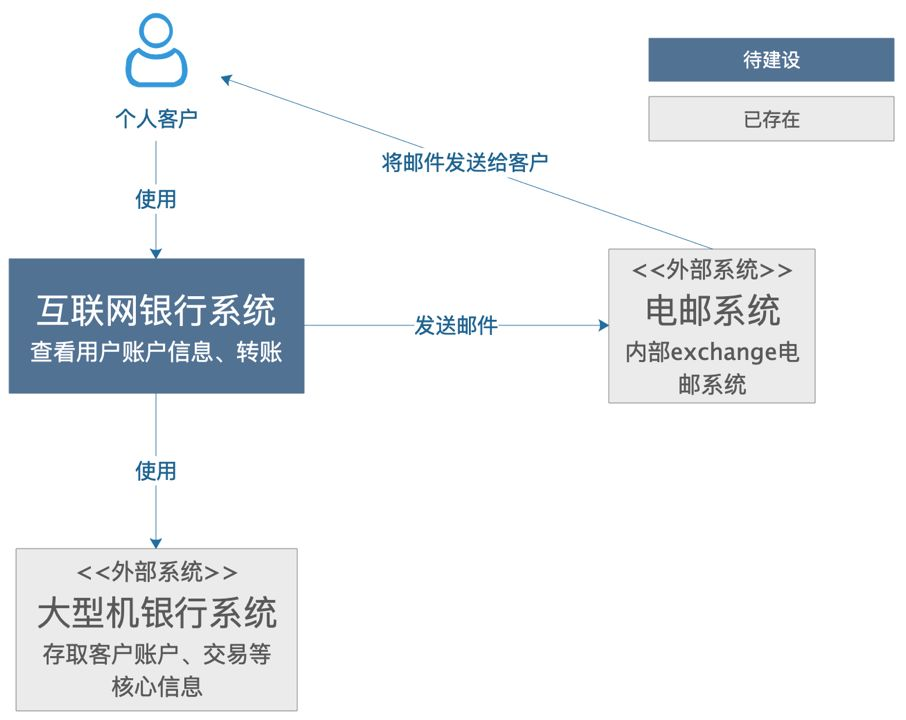
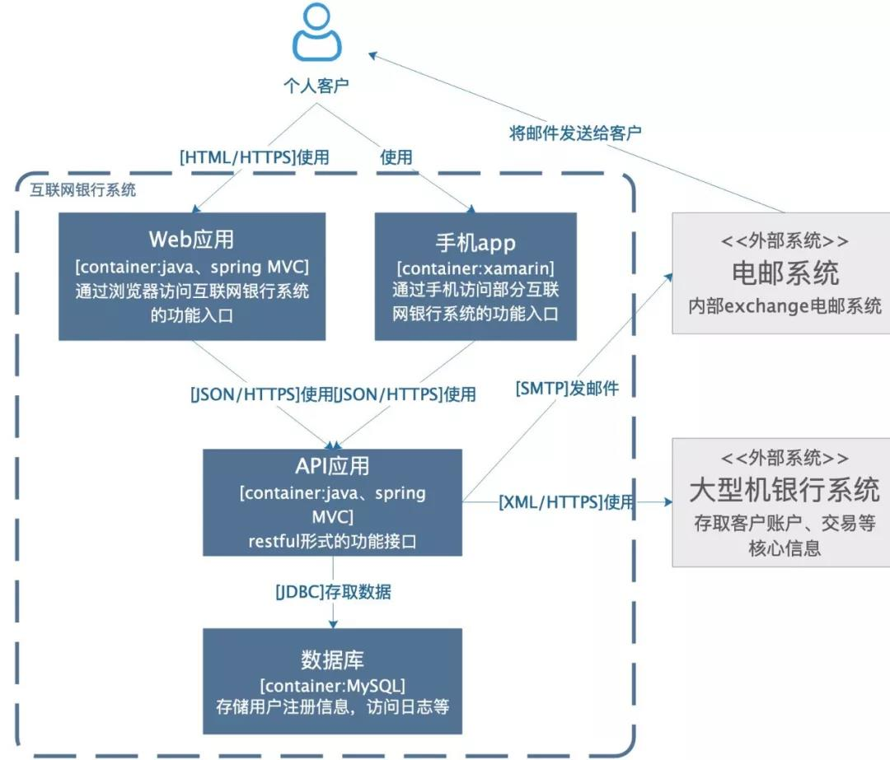
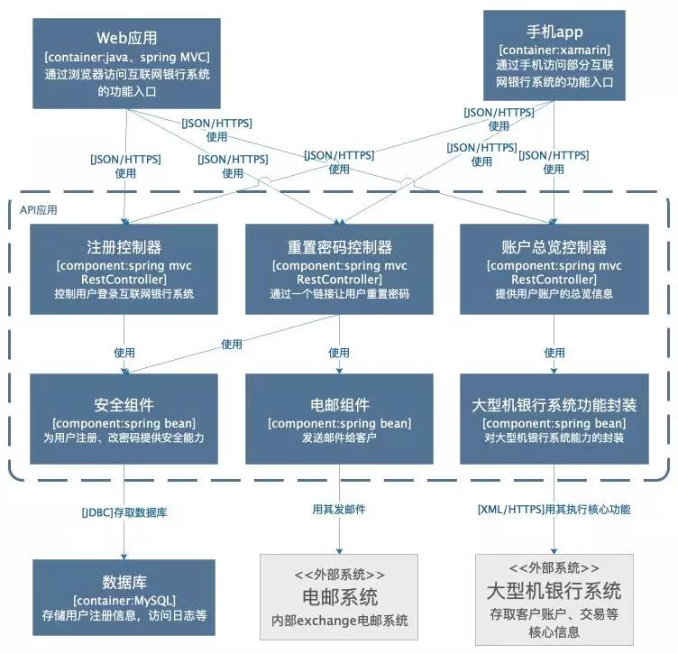

# 什么是架构
- 架构是对系统中的实体以及实体之间的关系所进行的抽象描述，是一系列的决策
- 架构是结构和愿景
系统架构是概念的体现，是对物/信息的功能与形式元素之间的对应情况所做的分配，是对元素之间的关系以及元素同周边环境之间的关系所做的定义。

# 什么是架构图
系统架构图是为了抽象地表示软件系统的整体轮廓和各个组件之间的相互关系和约束边界，以及软件系统的物理部署和软件系统的演进方向等整体视图。

## 架构图分类
+ 场景视图：用于描述系统的参与者与功能用例间的关系，反应系统的最终需求和交互设计，通常由用例图表示。
+ 逻辑视图：用于描述软件功能拆分后的组件关系，组件约束边界，反映系统整体组成与系统如何构建的过程，通常由UML组件图和类图表示
+ 处理流程视图：用于描述系统软件组件之间的通信时序，数据的输入/输出，反应系统的功能流程与数据流程，通常由时序图和流程图表示
+ 开发视图：用于描述系统的模块划分和组成，以及细化到内部包的组成设计，服务于开发人员，反映系统开发实施过程。

# 画图方法
C4模型使用容器（应用程序、数据存储、微服务等）、组件和代码来描述一个软件系统的静态结果。
1. 语境图（System Context Diagram）

这是一个想象的待建设的互联网银行系统，它使用外部的大型机银行系统存取客户账户、交易信息，通过外部电邮系统给客户发邮件。可以看到，非常简单、清晰，相信不需要解释，都看的明白，里面包含了需要建设的系统本身，系统的客户，和这个系统有交互的周边系统。

**用途**

这样一个简单的图，可以告诉我们，要构建的系统是什么；它的用户是谁，谁会用它，它要如何融入已有的IT环境。这个图的受众可以是开发人员，外部的技术/非技术人员。即：

- 构建的系统是什么
- 谁会用它
- 如何融入已有的IT环境

2. 容器图（Container Diagram）
容器图是把语境图里带建设的系统做了一个展开

**用途**

这个图的受众可以是团队内部或外部的开发人员，也可以是运维人员。用途可以罗列为：
- 展现了软件系统的整体形态
- 体现了高层次的技术决策
- 系统中的职责如何分布，容器间的是如何交互的
- 告诉开发者代码在哪里

3. 组件图（Component Diagram）

组件图是把某个容器进行展开，描述其内部的模块。

**用途**

这个图主要是给内部开发人员看的，怎么去做代码的组织和构建。其用途有：

- 描述了系统由哪些组件/服务组成
- 厘清了组件之间的关系和依赖
- 为软件开发如何分解交付提供了框架

4. 类图（Code Diagram）
