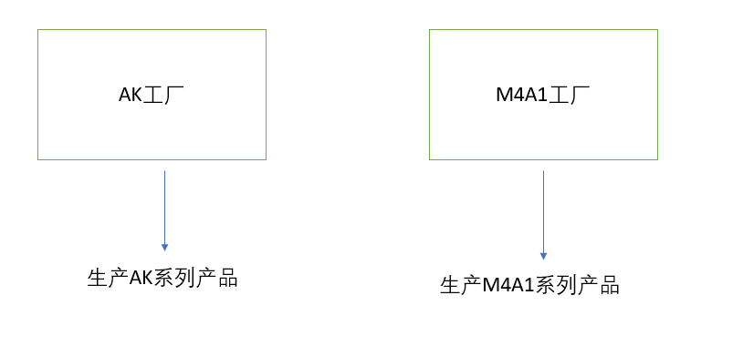

**图解设计模式-工厂模式**
# 工厂模式介绍
在基类中定义创建一个接口，让子类决定实例化哪个类。工厂方法让一个类的实例化延迟到子类中进行。
# 工厂模式分类
* 工厂方法模式（Factory Method）
* 抽象工厂模式（Abstract Factory）
# 为什么需要工厂模式
1) 解耦：把对象的创建和使用分开
2) 降低代码重复：如果创建某个对象的过程都很复杂，需要一定的代码量，而且很多地方都要用到，那么就会有很多代码重复
3) 降低维护成本：由于创建过程都由工厂统一管理，所以发生业务逻辑变化，不需要找到所有需要创建对象B的地方去逐个修正，只需要在工厂里修改即可，降低维护成本。
## 工厂方法模式
创建一个工厂接口和创建多个工厂实现类，这样一旦需要增加新的功能，直接增加新的工厂类就可以了，不需要修改之前的代码。


```
//定义行为接口-发送
public interface Sender {  
    void send();  
}

//定义两个实现类SMSSender和MailSender
public class SmsSender implements Sender {  
  
    @Override  
    public void send() {  
        System.out.println("this is sms sender!");  
    }  
}

public class MailSender implements Sender {  
    @Override  
    public void send() {  
        System.out.println("this is mailsender!");  
    }  
}

//提供一个接口
public interface Provider {  
    Sender produce();  
} 

//提供两个工厂类SendMailFafactory和SendSMSFactory
public class SendMailFactory implements Provider {  
      
    @Override  
    public Sender produce(){  
        return new MailSender();  
    }  
}  

public class SendSmsFactory implements Provider{  
  
    @Override  
    public Sender produce() {  
        return new SmsSender();  
    }  
}

//测试类
public class Test {  
  
    public static void main(String[] args) {  
        Provider provider = new SendMailFactory();  
        Sender sender = provider.produce();  
        sender.Send();  
    }  
} 
```

## 抽象工厂模式
在工厂方法模式中，其实我们有一个潜在意识的意识。那就是我们生产的都是同一类产品。抽象工厂模式是工厂方法的仅一步深化，在这个模式中的工厂类不单单可以创建一种产品，而是可以创建一组产品。

**抽象工厂方法模式角色分配**

1.抽象工厂（Abstract Factory）：是工厂方法模式的核心，与应用程序无关。任何在模式中创建的对象的工厂类必须实现这个接口。
2.抽象产品（Abstract Product）：工厂方法模式创建的对象的基类，也就是产品对象的父类或共同拥有的接口
3.具体工厂（ConcreteFactory）:实现抽象工厂接口的具体工厂类，包含与应用程序密切相关的逻辑，并且受到应用程序调用以创建某一种产品对象。
4.具体产品（ConcreteProduct）：抽象工厂模式所创建的任何产品对象都是某一个具体产品类的实例。

**抽象工厂模式实例**

在类似吃鸡的游戏中，存在各种枪。我们假设现在存在AK、M4A1两类枪，每一种枪对应一种子弹。我们现在这样考虑生产AK的工厂可以顺便生产AK使用的子弹，生产M4A1的工厂可以顺便生产M4A1使用的子弹。



```
//定义接口-枪
public interface Gun {
    public void shooting();
}
//定义接口-子弹
public interface Bullet {
    public void load();
}
//创建对应的实现类
public class AK implements Gun{

    @Override
    public void shooting() {
        System.out.println("shooting with AK");

    }

}

public class M4A1 implements Gun {

    @Override
    public void shooting() {
        System.out.println("shooting with M4A1");

    }

}

public class AK_Bullet implements Bullet {

    @Override
    public void load() {
        System.out.println("Load bullets with AK");
    }

}

public class M4A1_Bullet implements Bullet {

    @Override
    public void load() {
        System.out.println("Load bullets with M4A1");
    }

}

//创建工厂接口
public interface Factory {
    public Gun produceGun();
    public Bullet produceBullet();
}

//创建具体工厂
public class AK_Factory implements Factory{

    @Override
    public Gun produceGun() {
        return new AK();
    }

    @Override
    public Bullet produceBullet() {
        return new AK_Bullet();
    }

}

public class M4A1_Factory implements Factory{

    @Override
    public Gun produceGun() {
        return new M4A1();
    }

    @Override
    public Bullet produceBullet() {
        return new M4A1_Bullet();
    }

}

//测试
public class Test {
    public static void main(String[] args) {  
     Factory factory;
     Gun gun;
     Bullet bullet;

     factory =new AK_Factory();
     bullet=factory.produceBullet();
     bullet.load();
     gun=factory.produceGun();
     gun.shooting(); 
    }
}

//输出结果
Load bullets with AK
shooting with AK
```


