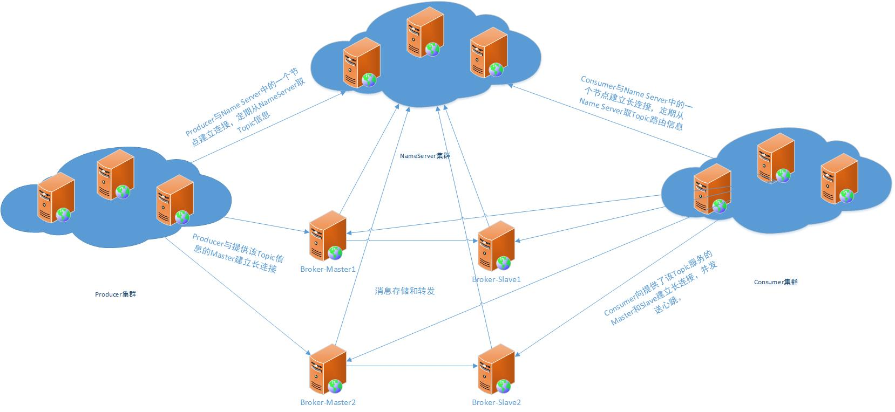

# 1 消息中间件简介
消息队列（Message Queue，MQ），消息中间件作为实现分布式消息系统可扩展、可伸缩性的关键组件，具有高吞吐量、高可用性等优点
# 2 常用消息队列对比
常用消息队列有RocketMQ、kafka、ActiveMQ、RabbitMQ等。

ActiveMQ、RabbitMQ只支持主从模式

Kafka、RocketMQ是分布式消息系统，支持分布式

这几个消息中间件都支持消息持久化

## 2.1 RocketMQ
RocketMQ是一款开源的分布式消息系统，基于高可用分布式集群技术，提供**低延迟、高可靠的**消息发布与订阅服务

## 2.2 Kafka
Kafka是**没有重发机制**的消息队列。它以**可水平扩展和高吞吐率**而被广泛使用。kafka不完全符合jms规范，注重吞吐率，类似udp和tcp。kafka**吞吐量大，对数据不保证百分之百送达，会有数据丢失**。所以kafka适合大数据量流转，比如日志数据，比如用作统计的数据。

## 2.3 ActiveMQ
ActiveMQ可以用于代理模式和P2P模式。类似于RabbitMQ，它易于实现高级场景，而且低消耗

## 2.4 RabbitMQ
RabbitMQ是AMQP协议领先的一个实现，它实现了代理（borker）架构，意味着消息在发送到客户端之前可以在中央节点排队。此特性使得RabbitMQ易于使用和部署，适用于很多场景，不如路由、负载均衡和消息持久化等，用消息队列只需几行代码即可敲定。但是，这也使得它可扩展性差，速度较慢，因为中央节点增加了延迟，消息封装后也比较大。

# 3 RocketMQ 主要组成
RocketMQ的主要组成：NameServer、Broker（代理）、Producer（消息生产者）、Consumer（消息消费者）

+ NameServer：rocketMQ名称服务器，大致相当于jndi，更新和发现broker服务。一个几乎无状态节点，可集群部署，节点之间无任何信息同步
+ Producer：消息生产者。Producer与NameServer集群中一个节点建立连接。定期从NameServer取Topic信息。并与提供该Topic信息的Master建立长连接。Producer也可以集群部署。
+ Consumer：消息消费者。Consumer与Name Server集群中的一个节点（随机选择）建立长连接，定期从Name Server取Topic路由信息，并向提供Topic服务的Master、Slave建立长连接，且定向Master、Slave发送心跳。Consumer既可以从Master订阅消息，也可以从Slave订阅消息，订阅规则由Broker配置决定。
+ Broker：消息中转角色，负责存储和转发消息。Broker分为Master和Slave。一个Master可以对应多个Slave，但是一个Slave只能对应一个Master。Master和Slave的对应关系通过指定相同的BrokerName，不同的BrokerId来定义。BrokerId为0表示Master，BrokerId非0表示为Slave。然后所有的Broker和Name Server上的节点建立长连接，定时注册Topic信息到所有Name Server。

## 3.1 RocketMQ存储特点
Consumer消费消息过程，使用了零拷贝，零拷贝包含以下两种方式：

| 方式 | 优点 | 缺点 |
| ----- | ----- | ---- |
|mmap+write|即使频繁调用，使用小块文件传输，效率也很高|不能很好的利用DMA方式，会比sendfile多消耗CPU，内存安全控制复杂，需要避免JVM Crash问题|
|sendfile|可以利用DMA方式，消耗CPU较少，大块文件传输效率高，无内存安全问题|小块文件效率低于mmap方式，只能是BIO方式传输，不能使用NIO|

RocketMQ选择了第一种方式，mmap + write，因为有小块数据传输的要求，效果会比sendfile更好。

## 3.2 RocketMQ集群配置

## 3.3 RocketMQ 的特性
+ Message Order：消息有序指的是一类消息消费时，能按照发送的顺序来消费。RocketMQ可以严格的保证消息有序。

+ Message Filter：
- Broker端过滤：Broker可以按照Consumer的要求做过滤，以减少对于Consumer无用消息的网络传输。缺点是增加了Broker的负担，实现相对复杂。淘宝Notify支持多种过滤，包含按照消息类型过滤，灵活的语法表达式过滤，几乎可以满足最苛刻的过滤需求。淘宝Rocket MQ支持按照简单的Message Tag过滤，也支持按照Message Header、body进行过滤。
- Consumer端过滤：可以实现自定义，缺点是很多无用的消息要传输到Consumer端。

+ Message Persistence：
消息中间件通常采用的几种持久化方式：

1. 持久化到数据库，例如Mysql
2. 持久化到KV存储，例如levelDB、伯克利DB等KV存储系统
3. 文件记录形式持久化，例如Kafka，RocketMQ
4. 对内存数据做一个持久化镜像，例如beanstalkd，visiNotify

Rocket MQ充分利用Linux文件系统内存cache来提供性能。

+ Message Reliability：消息可靠性。Rocket支持同步双写（异步复制，同步刷盘）

+ Low Latchcy Messaging：在消息不堆积情况下，消息达到Broker后，能立即到达Consumer。RocketMQ使用长轮询Pull方式，可保证消息非常实时，消息实时性不低于Push。

+ At least Once:每个消息必须投递一次。RocketMQ Consumer先pull消息到本地，消费完成后，才向服务器返回ack，如果没有消费一定不会ack消息，所以RocketMQ可以很好地支持此特性。

+ Exactly Only Once
1. 发送消息阶段，不允许发送重复的消息
2. 消费消息阶段，不允许消费重复的消息

RocketMQ为了追求性能不保证此特性，要求在业务上进行去重。RocketMQ虽然不能严格保证不重复，但是正常情况下很少会出现重复发送、消费情况，只有网络异常、Consumer启停等异常情况下会出现消息重复。

+ Broker的Buffer满了怎么办？
Broker的Buffer一般指的是Broker中一个队列的内存Buffer的大小。RocketMQ没有内存Buffer的概念，RocketMQ的队列都是持久化磁盘，数据定期清除。Rocket MQ的内存Buffer抽象成一个无限长度的队列，不管来多少数据，都能装的下，这种出现消息堆积的本质原因是网络调用存在不确定性，也即出现消费既不成功也不失败的第三种状态，所以才产生消息堆积和消息重复问题。
+ 回溯消费
回溯消费是指Consumer已经消费成功的消息，由于业务上的需要重新消费。
Rocket MQ支持按照时间回溯消费，时间维度精确到毫秒，可向前回溯也可向后回溯。

+ 消息堆积
消息中间件的主要功能是异步解耦，还有个重要功能是挡住前端的数据洪峰，保证后端系统的稳定性，这就要求消息中间件具有一定的消息堆积能力。

+ 分布式事务
已知的几个分布式事务规范，如XA，JTA等。其中XA规范被各大数据库厂商广泛支持，如Oracle，Mysql等。其中XA的TM实现佼佼者如Oracle Tuxedo，在金融、电信等领域被广泛应用。

分布式事务涉及到两阶段提交问题，在数据存储方面的方面必然需要KV存储的支持，因为第二阶段的提交回滚需要修改消息状态，一定涉及到根据Key去查找Message的动作。RocketMQ在第二阶段绕过了根据Key去查找Message的问题，采用第一阶段发送Prepared消息时，拿到了消息的Offset，第二阶段通过Offset去访问消息，并修改状态，Offset就是数据的地址。

RocketMQ这种实现事务方式，**没有通过KV存储做，而是通过Offset方式**，存在一个显著缺陷，即通过Offset更改数据，会令系统的脏页过多，需要特别关注。

+ 定时消息
定时消息是指消息发到Broker后，不能立刻被Consumer消费，要到特定的时间点或者等待特定的时间后才能被消费。如果要支持任意的时间精度，在Broker层面，必须要做消息排序，如果再涉及到持久化，那么消息排序要不可避免的产生巨大性能开销。

RocketMQ支持定时消息，但是不支持任意时间精度，支持特定的level，例如定时5s，10s，1m等。

+ 消息重试
Consumer消费消息失败后，要提供一种重试机制，令消息再消费一次。Consumer消费消息失败通常可以认为有以下几种情况：

1. 由于消息本身的原因，例如反序列化失败，消息数据本身无法处理（例如话费充值，当前消息的手机号被注销，无法充值）等。这种错误通常需要跳过这条消息，再消费其他消息，而这条失败的消息即使立刻重试消费，99%也不成功，所以最好提供一种定时重试机制，即过10s秒后再重试。
2. 由于依赖的下游应用服务不可用，例如db连接不可用，外系统网络不可达等。遇到这种错误，即使跳过当前失败的消息，消费其他消息同样也会报错。这种情况建议应用sleep 30s，再消费下一条消息，这样可以减轻Broker重试消息的压力。

## 3.4 Rocket MQ 特性总结
* 是一个队列模型的消息中间件，具有高性能、高实时、高可靠、分布式特点
* Producer、Consumer、队列都可以分布式
* Producer向一些队列轮流发送消息，队列集合称为Topic，Consumer如果做广播消费，则一个Consumer实例消费这个Topic对应的所有队列，如果做集群消费，则多个Consumer实力平均消费这个Topic对应的队列集合
* 能够保证严格的消息顺序
* 提供丰富的消息拉取模式
* 高校的订阅者水平扩展能力
* 实时的消息订阅机制
* 亿级消息堆积能力
* 较少的依赖

# 4 RocketMQ 数据存储结构
RocketMQ采取了一种数据与索引分离的存储方法。有效降低文件资源、IO资源，内存资源的损耗。即便是阿里这种海量数据，高并发场景也能够有效降低端到端延迟，并具备较强的横向扩展能力。
